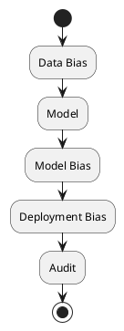

# Review: 11.3: Responsible AI — Fairness, Bias, Transparency

**Source:** part-iv/ch11-ai-in-institutions/lecture-03.adoc

---

## Review of Lecture 11.3 – “Responsible AI — Fairness, Bias, Transparency”

### Summary  
**Grade: C** – The lecture covers the essential concepts but falls short of a 90‑minute, engaging session. The narrative lacks a compelling hook and a clear forward‑moving arc; the material is far under‑dense (≈ 800 words vs. the 2 500‑3 500‑word target) and many sections read like definition dumps. The single PlantUML diagram is too abstract to reinforce the story. With a stronger opening scenario, richer examples, and more structured progression, the lecture could become a solid “B‑” or “A‑”.

---

## 1. Narrative Arc  

| Element | Current State | Verdict |
|---------|---------------|---------|
| **Hook** | Starts with an epigraph and a one‑sentence tagline. No concrete situation, no tension, no provocative question. | **Missing** – needs a vivid, real‑world vignette (e.g., a hiring AI that systematically rejects women). |
| **Development** | Lists fairness definitions, bias sources, and a brief audit workflow. The flow is “definition → list → note trade‑off”. No problem‑solution‑limit structure. | **Weak** – the lecture jumps between concepts without a unifying problem that students can follow. |
| **Closing / Bridge** | Ends with discussion prompts and lab prep, but no explicit “so what?” or link to the next lecture (e.g., governance or accountability). | **Incomplete** – a closing that ties fairness to the broader institutional AI governance theme is needed. |

**Overall Narrative Verdict:** The lecture has the ingredients but they are presented in a flat, encyclopedic style. A three‑act arc (scenario → audit & mitigation → societal implications) would give it the needed momentum.

---

## 2. Density (Target ≈ 2 500‑3 500 words)

| Section | Approx. Paragraphs | Approx. Key‑Points | Word Count (est.) |
|---------|-------------------|-------------------|-------------------|
| Conceptual Core | 4 | 5 | ~ 450 |
| Technical Example | 2 | 3 | ~ 200 |
| Philosophical Reflection | 2 | 4 | ~ 180 |
| **Total** | **8** | **12** | **≈ 830** |

**Gap:** Roughly **1 700‑2 600 words** missing. To reach the 90‑minute depth we need:

* 4‑6 additional paragraphs in the Conceptual Core (e.g., detailed case study, step‑by‑step bias‑audit pipeline, fairness‑metric trade‑off matrix).  
* 2‑3 richer paragraphs in the Technical Example (code snippets, visualisation of metric disparities, hands‑on debugging).  
* 2‑3 deeper philosophical paragraphs (history of fairness in law, stakeholder mapping, future‑policy scenarios).  

Key‑point count is acceptable, but each point should be expanded with sub‑bullets, examples, and “what‑if” questions.

---

## 3. Interest  

| Issue | Why it hurts engagement | Suggested fix |
|-------|------------------------|---------------|
| **No concrete scenario** | Students cannot see why fairness matters. | Open with a short story: *“A bank’s credit‑scoring model denied 70 % of loan applications from a minority neighbourhood. The model passed all internal tests, yet regulators halted it.”* |
| **Definition‑first dump** | Lists “demographic parity, equalized odds…” without context. | Introduce each metric through a *“What would you notice if you plotted the model’s predictions for Group A vs. Group B?”* then reveal the metric. |
| **Thin technical example** | Only a bullet list of steps; no data, no visual. | Add a mini‑case: load a public dataset (e.g., Adult), compute TPR/FPR per gender, show a bar chart, discuss the disparity. |
| **Philosophical reflection is repetitive** | Mirrors the Core without new insight. | Bring in a contrasting viewpoint (e.g., Rawlsian fairness vs. utilitarian trade‑off) and ask students to argue for one. |
| **Lab connection is vague** | “Add bias audit to the governance simulator” – no guidance on *how* to do it. | Provide a concrete lab snippet: a function `run_audit(model, data, group_col)` and a sample output. |

---

## 4. Diagram Review  

**Diagram 1 (PlantUML)**  



| Issue | Assessment | Concrete improvement |
|-------|------------|----------------------|
| **Alignment with narrative** | Shows a linear chain, but the lecture stresses *multiple* bias sources and a *feedback* audit loop. | Add parallel branches for “Data Bias” and “Deployment Bias”, converge on “Model”, then loop back from “Audit” to “Model” (showing mitigation). |
| **Missing labels / arrows** | No arrows indicating direction or causality; “Model” is ambiguous. | Label arrows: `Data → Model (training)`, `Model → Deployment`, `Audit → Model (re‑train)`. |
| **No metrics visualised** | The diagram never mentions the fairness metrics discussed. | Insert a box “Metrics (DP, EO, Calibration)” attached to “Audit”. |
| **Stylistic** | Uses default sketchy outline; could be more instructional. | Use `skinparam backgroundColor #F9F9F9` and `skinparam ArrowColor #0066CC`. Add a legend. |
| **Complexity** | Too simplistic for a 90‑min lecture. | Expand to a small “system diagram” with three layers: **Data → Model → Deployment**, each with a “Bias” node, and a central **Audit & Transparency** hub that feeds back. |

---

## 5. Recommended Revisions (Prioritized)

1. **Add a compelling opening vignette (≈ 2 paragraphs, 250 words).**  
   *Choose a recent, high‑profile case (e.g., facial‑recognition bias, hiring AI, credit scoring). Pose a provocative question: “Is the model fair, or is the data unfair?”*

2. **Re‑structure the Conceptual Core into a three‑act flow:**  
   - **Act 1 – The problem:** Show how bias manifests in the vignette.  
   - **Act 2 – The toolbox:** Introduce fairness definitions *through* the problem (e.g., “If we care about equal false‑negative rates, we need Equalized Odds”).  
   - **Act 3 – The limits:** Discuss incompatibility, trade‑offs, and the need for transparency.  
   *Add 2‑3 new paragraphs with concrete numbers from the vignette.*

3. **Enrich the Technical Example (≈ 4 paragraphs, 500 words).**  
   - Provide a short code snippet (Python/pandas) that computes TPR/FPR per group.  
   - Include a mock‑up bar chart (describe it).  
   - Walk through interpreting the results and deciding on a mitigation (re‑weighting, post‑processing).  
   - Connect explicitly to the Lab: “In Lab 2 you will implement `run_audit` and compare the before/after metrics.”

4. **Deepen the Philosophical Reflection (≈ 3 paragraphs, 350 words).**  
   - Contrast Rawlsian “fair equality of opportunity” with utilitarian “maximise overall accuracy”.  
   - Map stakeholders (regulators, users, affected groups) to the fairness definitions.  
   - Pose a forward‑looking question: “If a regulator mandates demographic parity, what does that mean for innovation?”

5. **Expand the discussion prompts (add 2‑3 “real‑world policy” questions).**  
   - Example: “How would GDPR’s ‘right to explanation’ shape the audit you just performed?”  

6. **Rewrite the PlantUML diagram (≈ 15 lines).**  
   ```plantuml
   @startuml
   skinparam backgroundColor #F9F9F9
   skinparam ArrowColor #0066CC

   package "Data Layer" {
     [Historical Data] --> [Training Set] : sampling
     [Training Set] --> [Model] : train
   }

   package "Model Layer" {
     [Model] --> [Deployment] : serve
   }

   package "Deployment Layer" {
     [Deployment] --> [End‑User] : predictions
   }

   package "Audit & Transparency" {
     [Audit] --> [Metrics] : compute (DP, EO, Calib)
     [Metrics] --> [Model] : feedback (re‑train / adjust)
     [Audit] --> [Documentation] : record findings
   }

   [Historical Data] --> [Audit] : bias check
   [Deployment] --> [Audit] : monitor
   @enduml
   ```
   *Add a legend for the three bias sources and the feedback loop.*

7. **Increase word count to meet the 90‑minute target.**  
   - Aim for **≈ 2 800 words** total.  
   - Use sub‑headings (e.g., “Case Study: Credit‑Scoring Bias”) to break up text and guide pacing.

8. **Add a “Bridge to Next Lecture” paragraph (≈ 100 words).**  
   - Explain how fairness metrics feed into the broader **AI Governance** framework (e.g., risk registers, accountability boards) that will be covered in Lecture 11.4.

---

### Final Note
Implementing the above changes will transform Lecture 11.3 from a terse checklist into a narrative‑driven, interactive session that can comfortably fill a 90‑minute class, keep students intellectually hooked, and provide concrete technical practice aligned with the lab component.