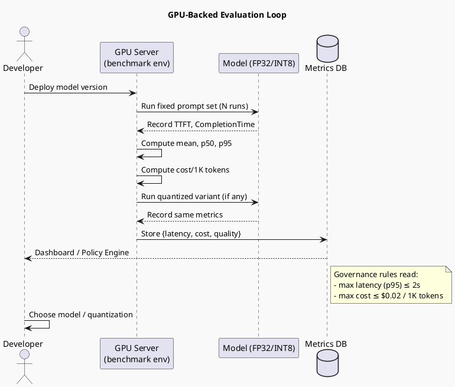

# Review: 11.5: GPU-Backed Evaluation — Latency, Cost, Quantization

**Source:** part-iv/ch11-ai-in-institutions/lecture-05.adoc

---

## Review of Lecture 11.5 – “GPU‑Backed Evaluation: Latency, Cost, Quantization”

### Summary  
**Grade: C** – The lecture covers the right topics but falls short of a 90‑minute, engaging session. The narrative arc is weak (no vivid hook, limited tension, and a flat closing), the word count is well under the 2 500–3 500 word target, and the sole PlantUML figure is too abstract to reinforce the story. With concrete scenarios, richer examples, and a more purposeful diagram the lecture could become a solid B‑level module.

---

## 1. Narrative Arc  

| Element | Verdict | Comments |
|--------|---------|----------|
| **Hook** | ❌ Weak | The opening epigraph and a list of “example prompts” are generic. There is no concrete situation that makes the stakes of latency, cost, or quantization feel urgent. |
| **Development** | ⚠️ Partial | The Conceptual Core explains *what* to measure, *how* to measure, and *why* it matters, but the flow is a series of bullet‑style statements rather than a problem → response → limitation progression. |
| **Closing / Bridge** | ⚠️ Minimal | The lab tie‑in is the only forward motion, but it is presented as a checklist rather than a narrative payoff (“Now you will see how these numbers drive policy”). |
| **Overall Arc** | ❌ Needs stronger tension and a clear “call to action”. |

**Suggested Hook** – Open with a short story: *“A fintech startup launches a GPT‑4‑powered customer‑support bot. Within minutes the API bill spikes to $12 K because each query takes 3 s on a single GPU. The product is pulled offline, investors lose confidence, and the team scrambles to understand why the model that looked perfect in dev now costs a fortune in production.”* Follow with the provocative question: *“How can we guarantee that an AI service stays fast **and** affordable when we scale?”*  

**Development** – Frame the lecture as a three‑stage investigation:  

1. **Problem** – Latency and cost hidden in the “black‑box” of inference.  
2. **Response** – Systematic GPU‑backed benchmarking + quantization as a lever.  
3. **Limit** – Governance constraints (budget caps, latency SLAs) that force trade‑offs and require documented decisions.  

**Closing** – End with a forward‑looking statement: *“Armed with these numbers, you will be able to write policies that automatically select the cheapest model that still meets a 2‑second response SLA – a capability we will implement in Lab 2‑3.”*

---

## 2. Density (Target ≈ 2 500–3 500 words)

| Section | Paragraphs | Key‑point items | Approx. word count* |
|---------|------------|----------------|---------------------|
| **Conceptual Core** | 4 | 7 | ~650 |
| **Technical Example** | 2 | 4 | ~350 |
| **Philosophical Reflection** | 2 | 4 | ~300 |
| **Total** | 8 | 15 | **≈ 1 300** |

\*Rough estimate based on typical paragraph length (≈ 80–100 words).  

**Result:** The lecture is roughly **60 %** of the required length. It needs **additional exposition**, **more detailed examples**, and **expanded discussion of quantization techniques** (e.g., static vs. dynamic, post‑training vs. quant‑aware training) to reach the 2 500–3 500 word window.

---

## 3. Interest (Engagement)

| Issue | Why it hurts attention | Quick fix |
|-------|------------------------|-----------|
| **Definition‑first style** – latency, cost, quantization are introduced as terms before any story. | Learners may tune out before seeing relevance. | Start each term with a real‑world anecdote (e.g., “When a user waits 1.2 s for the first token, they abandon 30 % of the session”). |
| **Thin technical example** – only a generic “run prompts 10×”. | No sense of the practical challenges (GPU warm‑up, batch size effects, token‑level profiling). | Add a step‑by‑step walkthrough of a `torch.cuda.synchronize()` timing script, show a sample output table, and discuss variance sources. |
| **Philosophical reflection is brief** – repeats earlier points without new insight. | Missed opportunity to spark debate about “measurement as power”. | Insert a short case study where a cost‑only metric led a company to drop a fairness‑focused model, prompting a policy revision. |
| **Lab description is a checklist** – no narrative of what students will *discover*. | Reduces curiosity. | Phrase the lab as a *detective mission*: “Find the cheapest model that still meets a 2 s SLA for a 500‑token prompt.” |

---

## 4. Diagram Review (PlantUML)

**Current diagram** – a linear flow: `Model → Latency → Cost/token → Quantization → Benchmark`.  

**Problems**

1. **Too generic** – does not illustrate measurement loops, governance constraints, or the role of the GPU.  
2. **Missing feedback** – No arrow showing that benchmark results feed back into policy decisions.  
3. **No labels for key metrics** (TTFT, p95, cost per 1K).  
4. **No representation of “environment reproducibility”** (same hardware, same config).  

**Suggested redesign (still PlantUML, but richer)**  

*Key improvements*:  

* Shows **environment** (GPU server) and **reproducibility** (same hardware).  
* Highlights **two runs** (full‑precision vs. quantized).  
* Stores results in a **Metrics DB** that feeds a **policy engine** – closing the loop to governance.  
* Adds **labels** for TTFT, p95, cost per 1K tokens.  

If the sketchy‑outline theme is required, keep it but ensure the above logical elements are present.

---

## 5. Recommended Revisions (Prioritized)

1. **Rewrite the opening (Hook).**  
   *Insert a 2‑sentence real‑world vignette* that foregrounds the danger of uncontrolled latency/cost. Follow with a provocative question.

2. **Expand the Conceptual Core to ~6 paragraphs (~1 200 words).**  
   - Paragraph 1: Problem statement (scale‑up surprise).  
   - Paragraph 2: Why latency matters (user experience, SLA).  
   - Paragraph 3: Why cost matters (budget, sustainability).  
   - Paragraph 4: Quantization basics (static vs. dynamic, trade‑offs).  
   - Paragraph 5: Governance perspective (policy loops).  
   - Paragraph 6: Summary & transition to lab.

3. **Enrich the Technical Example (≈ 500 words).**  
   - Provide a concrete code snippet (e.g., `torch.cuda.Event` timing).  
   - Show a sample table of results (FP32 vs. INT8).  
   - Discuss variance sources (GPU warm‑up, batch size, token length).  
   - Explain how to compute cost from cloud provider pricing.

4. **Deepen the Philosophical Reflection (≈ 400 words).**  
   - Add a short case study where cost‑only metrics led to fairness compromise.  
   - Pose a debate question: *“Should a regulator mandate latency reporting alongside fairness audits?”*  

5. **Replace the current PlantUML diagram with the richer loop diagram** (see above). Add brief caption explaining each component.

6. **Re‑write Lab Prep as a narrative challenge.**  
   - Frame the lab as “You must design a compliance checker that automatically rejects any model that exceeds the p95 latency of 2 s or cost of $0.02 per 1 K tokens.”  
   - List deliverables (benchmark script, policy JSON, pass/fail report).

7. **Add a “Key Take‑aways” slide** (3‑4 bullet points) at the very end to reinforce the narrative arc.

8. **Proofread for consistency** – ensure all metric abbreviations (TTFT, p95, cost/1K) are defined once and then reused.

---

### Closing Thought  
By turning the lecture into a story of *“discovering why a seemingly perfect model broke the budget and user experience, then measuring, quantizing, and governing it back into shape,”* students will stay engaged for the full 90 minutes, and the material will meet the textbook’s pedagogical standards.