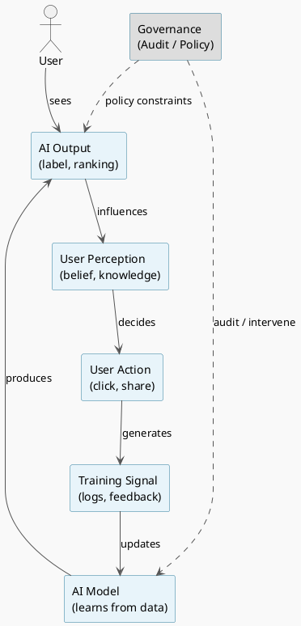

# Review: 11.6: Epistemology and Infrastructure

**Source:** part-iv/ch11-ai-in-institutions/lecture-06.adoc

---

## Review of Lecture 11.6 – *Epistemology and Infrastructure*  

**Grade: C** – The lecture contains the right ingredients (conceptual core, technical example, philosophical reflection) but falls short of the 90‑minute narrative density and engagement standards. The hook is weak, the development is fragmented, and the diagram does not illustrate the feedback loop it is meant to convey.

---

### 1. Narrative Arc  

| Element | Verdict | Comments |
|---------|---------|----------|
| **Hook** | ❌ Weak | The “Example Prompts” are a list of questions, not a vivid scenario. There is no concrete story that puts students immediately on the hook (e.g., a news‑feed algorithm that suddenly “creates” a political echo chamber). |
| **Development** | ⚠️ Fragmented | The **Conceptual Core** jumps from “who decides what the system knows?” to a definition of *epistemic infrastructure* and then to *institutional epistemology* without a clear problem → response → limit progression. The **Technical Example** repeats the same loop in a generic way, and the **Philosophical Reflection** restates points already made. |
| **Closing / Bridge** | ⚠️ Minimal | The lab prompt and discussion questions are present, but they are not framed as a natural culmination of the story introduced at the start. There is no explicit “so what now?” that ties the epistemic loop to the upcoming capstone or to real‑world policy debates. |

**Overall narrative verdict:** The lecture lacks a compelling arc. It needs a concrete opening vignette, a step‑by‑step unpacking of the epistemic feedback loop, and a closing that points to the next lab or to a policy‑relevant “take‑away”.

---

### 2. Density (Target ≈ 2 500‑3 500 words)

| Section | Paragraphs | Key‑point items | Approx. word count* |
|---------|------------|-----------------|---------------------|
| Conceptual Core | 3 | 6 | ~650 |
| Technical Example | 2 | 4 | ~350 |
| Philosophical Reflection | 2 | 4 | ~300 |
| **Total** | **7** | **14** | **≈ 1 300** |

\*Rough estimate (based on typical 150‑200 w/para).  

**Gap:** The lecture is roughly **1 200‑1 500 words short** of the 90‑minute target. It also falls below the recommended paragraph count (4‑6 for core, 2‑3 for each of the other sections).  

---

### 3. Interest & Engagement  

| Issue | Why it hurts attention | Suggested fix |
|-------|------------------------|---------------|
| **Definition‑first dump** (e.g., “Epistemic infrastructure refers to…”) | Students hear a dictionary entry before seeing why it matters. | Start with a *real‑world incident* (e.g., a recommendation algorithm that amplified misinformation during an election) and let the definition emerge from the story. |
| **Repetition** (same loop described three times) | Redundant phrasing reduces momentum. | Consolidate the loop into one clear, illustrated narrative; use the later sections to explore *variations* (bias amplification, emergent categories, regulatory interventions). |
| **Thin technical example** | Only a generic “click → retrain” description; no data, no metrics, no trade‑offs. | Provide a mini‑case study: show a toy dataset, a simple collaborative‑filtering model, and a concrete metric (e.g., “diversity of recommendations”) that degrades over iterations. |
| **Philosophical reflection** – mostly restates Foucault without connecting to AI practice. | Risks feeling like a filler. | Link the philosophy directly to design decisions (e.g., “Choosing a ‘relevance’ threshold is a political act”). Use a short dialogue between a data scientist and a policy analyst. |
| **Lack of tension** | No sense of stakes (e.g., “What if the loop entrenches harmful stereotypes?”). | Pose a provocative question early: “When does a recommendation engine stop being a tool and start becoming a gatekeeper of truth?” |

---

### 4. Diagram Review  

**Current PlantUML (Diagram 1)**  

```
@startuml
start
:AI Output;
:Human Belief;
:Training Data;
stop
@enduml
```

| Issue | Why it’s insufficient | Concrete improvement |
|-------|----------------------|-----------------------|
| **No feedback arrows** – the loop is linear, not cyclical. | The text stresses a *feedback loop* (output → belief → behavior → data → model). | Add arrows that close the loop: `Human Belief --> Human Action --> Training Data --> AI Model --> AI Output`. |
| **Missing labels** – boxes are generic (“AI Output”). | Students cannot map each step to the concepts discussed (e.g., “Category label”, “User click”). | Rename boxes: `AI Output (label/category)`, `User Perception`, `User Action (click)`, `Collected Signal`, `Model Update`. |
| **No representation of institutional actors** – the diagram only shows AI ↔ human. | The lecture talks about *institutional epistemology* (editors, regulators). | Add a side entity “Institution / Governance Layer” that can intervene (e.g., “Audit”, “Policy Override”). Use a dashed arrow to indicate optional control. |
| **Stylistic** – “sketchy‑outline” theme is fine, but the diagram is too sparse for a 90‑min lecture. | It will not sustain visual interest. | Introduce colors for the two “domains” (AI vs Human), and a looping arrow with a “reinforcement” label. Consider a small inset showing a concrete example (e.g., “News article → recommendation → click → retrain”). |

**Revised PlantUML sketch (conceptual)**  



---

### 5. Recommended Revisions (Prioritized)

1. **Rewrite the opening hook**  
   - Begin with a 2‑paragraph *case vignette* (e.g., a streaming platform’s recommendation engine that gradually narrows a user’s political exposure). End the vignette with a provocative question: “Who decided what this user now ‘knows’?”  
2. **Expand the Conceptual Core to 4‑5 paragraphs**  
   - Paragraph 1: Present the vignette and pose the problem.  
   - Paragraph 2: Define *epistemic infrastructure* *through* the vignette (not as a dictionary entry).  
   - Paragraph 3: Introduce *institutional epistemology* and give concrete institutional actors (regulators, editors).  
   - Paragraph 4: Explain the feedback loop with a brief numeric illustration (e.g., “After three retraining cycles, the diversity score fell from 0.73 to 0.41”).  
   - Paragraph 5: Summarize the governance challenge.  
3. **Enrich the Technical Example** (≈ 350 words)  
   - Provide a toy dataset (e.g., 5 items, click counts). Show a simple matrix factorization step and how the model’s top‑k list changes after each retraining.  
   - Include a table or chart (could be a small ASCII table) to visualise the drift.  
   - Highlight the *epistemic impact* (e.g., “Item A becomes “must‑watch” for 80 % of users”).  
4. **Deepen the Philosophical Reflection** (≈ 300 words)  
   - Add a short dialogue: *Data Scientist* vs *Policy Analyst* debating whether to expose the “relevance” threshold.  
   - Connect Foucault’s power/knowledge to a concrete design decision (e.g., “Choosing a confidence cutoff is a political act”).  
5. **Revise the diagram** (as per the revised PlantUML code).  
   - Insert the new diagram after the Technical Example and reference it explicitly (“Figure 11.6 visualises the loop we just traced”).  
6. **Add a “Take‑away Bridge”** (≈ 150 words)  
   - Conclude with a forward‑looking paragraph: how the epistemic loop will be explored in Lab 3 and how it ties to the upcoming capstone on AI governance.  
7. **Adjust Key‑Point Lists**  
   - Ensure each list contains 6‑8 items, each phrased as an *actionable insight* (“Identify the categories your system creates”, “Map the feedback loop in your data pipeline”).  
8. **Word‑count bump**  
   - Insert a 2‑paragraph “Real‑world implications” box (e.g., impact on journalism, healthcare triage) to reach the 2 500‑3 500 word target.  

---

### Quick Checklist for the Author  

- [ ] Hook: concrete, tension‑filled scenario (2 paras).  
- [ ] Core: 4‑5 paragraphs, includes numeric illustration.  
- [ ] Technical example: specific dataset, before/after model output, 2‑3 paras.  
- [ ] Philosophical reflection: dialogue + design‑policy link.  
- [ ] Diagram: loop with labels, governance overlay, updated PlantUML.  
- [ ] Closing bridge to Lab 3 / capstone.  
- [ ] Total word count ≈ 2 800 – 3 200.  

Implementing these changes will transform Lecture 11.6 into a cohesive, story‑driven session that fills a 90‑minute slot, keeps students intellectually engaged, and visually reinforces the central concept of *epistemic feedback*.