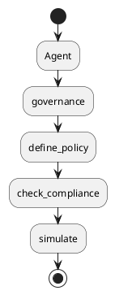
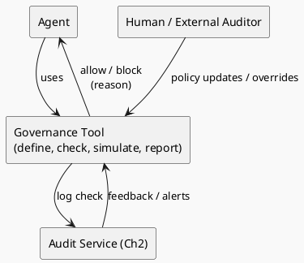

# Review: 11.7: The governance Tool

**Source:** part-iv/ch11-ai-in-institutions/lecture-07.adoc

---

## Review of Lecture 11.7 – *The Governance Tool*  

**Grade: C** – The lecture contains the required material but falls short of a 90‑minute, engaging session. The narrative arc is weak, the word‑count is far below the 2 500‑3 500 target, and the sole diagram does not illuminate the concept. Substantial expansion and restructuring are needed before the lecture can sustain a full class period.

---

### 1. Narrative Arc  

| Element | What the lecture currently does | Verdict |
|---------|--------------------------------|---------|
| **Hook** | Starts with an epigraph and a list of example prompts. No concrete scenario, story, or provocative question that pulls students in. | **Missing** – the opening is definition‑heavy. |
| **Development** | Describes the four API calls of the governance tool, then briefly mentions self‑audit and limits. The flow is “tool → operations → integration → limits” but there is no problem → attempted solution → emerging tension structure. | **Weak** – steps are listed rather than built as a narrative. |
| **Closing / Bridge** | Ends with discussion prompts and lab prep, but no explicit “so what?” statement that ties the tool to real‑world governance challenges or to the next lecture (e.g., policy enforcement in multi‑agent systems). | **Insufficient** – the ending feels abrupt. |

**Overall verdict:** The lecture lacks a clear narrative arc. It reads like a specification sheet rather than a story that moves from a compelling problem to a tentative solution and then to open questions.

---

### 2. Density (Target ≈ 2 500‑3 500 words)

| Section | Current paragraphs | Current key‑point bullets | Approx. word count* |
|---------|-------------------|---------------------------|---------------------|
| Conceptual Core | 4 | 7 | ~650 |
| Technical Example | 3 | 3 | ~500 |
| Philosophical Reflection | 3 | 4 | ~450 |
| **Total** | 10 | 14 | **≈ 1 600** |

\*Word counts are rough estimates based on the supplied text.

**Gap:** ~1 000‑1 500 words missing. The lecture should contain **4‑6 substantive paragraphs** in the Conceptual Core (≈ 1 200‑1 800 words) and **2‑3 richer paragraphs** in the Technical Example and Philosophical Reflection each (≈ 800‑1 200 words combined).  

**Key‑point density** is acceptable (5‑8 per section) but the prose around them is too terse.

---

### 3. Interest & Engagement  

| Issue | Why it hurts attention | Suggested fix |
|-------|------------------------|--------------|
| **No concrete opening scenario** | Students cannot see why “governance as a tool” matters until later. | Open with a vivid case study (e.g., a financial‑advisor chatbot that must refuse a high‑value transaction that exceeds a regulatory limit). Pose the question: *“What should the bot do when a user asks for a $10 000 transfer that violates the bank’s policy?”* |
| **Definition‑first dump** | The four operations are listed before any problem context. | Re‑order: present the problem → show a failed “post‑hoc audit” → introduce the *governance tool* as a *preventive* mechanism. |
| **Lack of tension** | The “limits of self‑audit” are mentioned only at the end, without showing a scenario where the tool fails. | Include a “gotcha” example: a policy that the agent cannot introspect (e.g., a hidden bias rule) leading to a compliance breach despite the tool. |
| **Sparse technical depth** | The technical example is a high‑level checklist; students will need more concrete code snippets or pseudo‑code. | Add a short Python‑style stub showing how `check_compliance` is called from the agent loop, and a simple policy DSL (e.g., JSON rule). |
| **Philosophical reflection is brief** | The reflection repeats the same points without linking to broader debates (e.g., “responsibility gap”, “instrumental vs. normative governance”). | Expand with a comparison to human regulatory bodies, a short quote from the EU AI Act, and a “what‑if” discussion about autonomous agents in high‑stakes domains. |
| **Diagram is too simplistic** | The flowchart shows only boxes with names; it does not illustrate the *feedback loop* between agent, governance, and audit. | Redesign the diagram (see below). |

---

### 4. Diagram Review  

**Current PlantUML (Diagram 1)**  

| Problem | Recommendation |
|---------|----------------|
| **Linear, no interaction** – The diagram suggests a one‑way sequence rather than a *tool server* that the agent calls repeatedly. | Replace the linear flow with a **component diagram**: `Agent` → (uses) `Governance Tool Server` → (exposes) `define_policy`, `check_compliance`, `simulate`, `report`. Show a bidirectional arrow to `Audit Service` (from Ch 2) indicating “log” and “feedback”. |
| **Missing labels** – No indication of when each operation is invoked (e.g., “pre‑action check”). | Add **activity notes** or **guard conditions** on the arrows, e.g., `check_compliance(action)` labeled “pre‑action”. |
| **No representation of external oversight** – The limits of reflexive governance are not visualised. | Add a third component `Human Oversight / External Auditor` with a dotted arrow to `Governance Tool` labeled “policy updates / override”. |
| **Stylistic** – The “sketchy-outline” theme is fine, but the diagram is too small to be useful on a slide. | Increase font size, use `rectangle` shapes for components, and colour‑code: Agent (blue), Governance (green), Audit (orange), Human (purple). |

**Suggested PlantUML (concise version):**

---

### 5. Recommended Revisions (prioritized)

1. **Rewrite the opening (Hook).**  
   - Begin with a 2‑3 minute *case vignette* (e.g., a medical‑diagnosis assistant asked to prescribe a drug that violates dosage limits).  
   - Pose a provocative question: *“Should the assistant be able to refuse the request on its own?”*  

2. **Restructure the narrative flow.**  
   - **Problem → Attempted Solution → Emerging Tension → Partial Resolution → Open Questions**.  
   - Use sub‑headings: “Why post‑hoc audits are insufficient”, “Introducing a proactive governance tool”, “When the tool fails”.  

3. **Expand the Conceptual Core to ~1 200‑1 800 words.**  
   - Add 2‑3 paragraphs on: (a) policy representation (rule languages, hierarchy), (b) placement in the agent stack (compare to memory, reasoning, tool servers), (c) interaction patterns (synchronous vs. asynchronous checks).  
   - Increase key‑point list to 8‑10 items, each with a one‑sentence elaboration.

4. **Enrich the Technical Example (~800 words).**  
   - Provide a concrete pseudo‑code snippet showing the agent loop, the `check_compliance` call, and handling of a `block` result.  
   - Include a minimal JSON policy example and a short test harness for the `simulate` operation.  
   - Explain how the lab assignment maps to these snippets (e.g., “implement `evaluate_action` using a rule engine”).  

5. **Deepen the Philosophical Reflection (~800 words).**  
   - Connect reflexive governance to the “responsibility gap” literature.  
   - Contrast EU AI Act’s “high‑risk” categorisation with the technical limits of self‑audit.  
   - Offer a “what‑if” scenario (e.g., an adversary manipulates the policy store) and ask students to discuss mitigation.  

6. **Redesign the diagram** (see PlantUML suggestion).  
   - Insert the new component diagram after the Conceptual Core.  
   - Reference the diagram explicitly in the text (“Figure 11.7 shows the three‑way interaction…”) to make it integral to the narrative.  

7. **Add a “Bridge to the Next Lecture”.**  
   - Conclude with a forward‑looking sentence: *“Having equipped agents with a governance tool, the next step is to coordinate multiple agents under a shared policy framework (see Lecture 12).”*  

8. **Trim redundant key‑point bullets** (e.g., merge overlapping items) and ensure each bullet adds a distinct learning outcome.  

9. **Proofread for consistency** (e.g., use “governance tool” vs. “Governance Tool” uniformly) and verify citations (`<<EU2024>>`, `<<NIST2023>>`) are correctly formatted.

---

**By implementing the above changes, the lecture will:**

* Capture students’ attention from the start with a relatable dilemma.  
* Provide a clear, step‑by‑step narrative that builds tension and invites inquiry.  
* Reach the required word count and depth for a 90‑minute session.  
* Offer concrete technical material that aligns with the lab work.  
* Use a diagram that visually reinforces the interaction model.  

Once revised, the lecture should comfortably fill a full class period and stimulate both practical implementation and critical discussion.