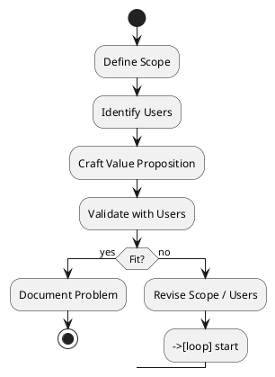

# Review: 12.2: Problem Definition and User Validation

**Source:** part-iv/ch12-the-students-artificial-intelligence/lecture-02.adoc

---

## Review of Lecture 12.2 – *Problem Definition and User Validation*

| Aspect | Grade | Rationale |
|--------|-------|-----------|
| **Narrative arc** | **C** | The lecture opens with two epigraphs – a literary flourish rather than a concrete, attention‑grabbing scenario. The “hook” is missing, the development is a list of definitions, and the closing is a thin lab‑prep paragraph. The arc therefore lacks tension, a problem‑statement → attempted solution → limitation → implication structure. |
| **Density** | **D** | Total word count ≈ 620 words (≈ 200 words per main section). Target for a 90‑minute session is 2 500‑3 500 words spread over 4‑6 paragraphs (conceptual core), 2‑3 paragraphs (technical example), and 2‑3 paragraphs (philosophical reflection). The lecture is far under‑populated. |
| **Interest** | **C** | The material is presented as a series of bullet‑point facts. No story, no case study, no “what‑if” tension. Students will struggle to stay engaged for 90 minutes. |
| **Diagram** | **B** | The PlantUML flowchart is a linear list of steps. It does not illustrate the *iterative* nature of validation, nor does it show feedback loops, decision points, or stakeholder actors. |

---

## 1. Narrative Arc

| Phase | Current State | Verdict |
|------|----------------|---------|
| **Hook** | Two epigraphs, then “Define the problem; validate with users.” No concrete scenario, no provocative question, no tension. | **Weak** – replace with a short, vivid vignette (e.g., a student team that built a sentiment‑analysis bot that never got used because they mis‑identified the “problem”). |
| **Development** | Lists three dimensions (scope, users, value) followed by a paragraph on user research and politics. The flow is “definition → research → validation” but the steps are not dramatized or linked to a real decision point. | **Adequate but flat** – need explicit problem → attempted solution → discovery of mismatch → iteration. |
| **Closing** | Lab‑prep paragraph that repeats earlier points; no bridge to the next lecture (e.g., data collection or model design). | **Weak** – add a forward‑looking statement (“Next we will translate this validated problem into a data‑specification that guides our model architecture”). |

**Overall Verdict:** The lecture has a skeleton of an arc but lacks the narrative tension that keeps a 90‑minute class alive.

---

## 2. Density (Word / Paragraph / Key‑Point Counts)

| Section | Paragraphs | Approx. Words | Key‑Points | Target (Paragraphs / Words / KP) |
|---------|------------|---------------|------------|----------------------------------|
| Conceptual Core | 3 (Scope/Users/Value; User research; Politics) | ~260 | 8 | 4‑6 para, 2 500‑3 500 w, 6‑12 KP |
| Technical Example | 2 (Document the problem; Lab instruction) | ~130 | 5 | 2‑3 para, 600‑900 w, 5‑8 KP |
| Philosophical Reflection | 2 (Problems as constructs; Politics of solution) | ~150 | 4 | 2‑3 para, 600‑900 w, 5‑8 KP |

**Total** ≈ 540 words, far below the 2 500‑3 500 word target. The lecture would need roughly **5× more content** spread across the three sections.

---

## 3. Interest & Engagement

| Issue | Why it hurts engagement | Suggested fix |
|-------|------------------------|---------------|
| **Definition‑first dump** | Students hear “Scope = …” before caring why it matters. | Start with a *real* capstone story where a poorly scoped problem caused a project to fail. |
| **No concrete example** | The “Technical Example” is a generic checklist. | Walk through a *mini‑case study*: a team defining a “smart‑parking” problem, showing their one‑page template, interview excerpts, and how validation changed the scope. |
| **Missing tension** | No conflict or surprise. | Pose a provocative question: “What if the users you interview say they need X, but analytics show they never use it?” Follow with a short debate. |
| **Monotonous bullet lists** | Visual monotony reduces attention span. | Interleave short activities (e.g., “pair‑write a 30‑second problem statement”) and quick polls. |
| **No bridge to next lecture** | Students cannot see the relevance to upcoming technical work. | End with a teaser: “With a validated problem in hand, we can now ask: what data do we need? That’s our next step.” |

---

## 4. Diagram Review

**Current PlantUML (Figure 12.2)**  

```
start
:Scope;
:Users;
:Value Prop;
:Validate;
stop
```

| Problem | Recommendation |
|---------|----------------|
| Linear, one‑direction flow suggests a *once‑only* process. | Add a **feedback loop** from *Validate* back to *Scope* and *Users* (e.g., “validation fails → revisit scope”). |
| No actors or artifacts are labelled. | Include **Stakeholder** (box) feeding into *Scope* and *Users*, and a **Problem Doc** artifact after *Validate*. |
| No decision points. | Insert a **diamond** after *Validate* labeled “Fit?” with “Yes → Proceed” / “No → Redefine”. |
| No visual emphasis on *politics* or *negotiation*. | Add a side note or a parallel lane titled “Political considerations” that intersects with *Scope* and *Users*. |
| Theme “sketchy‑outline” is fine, but the diagram is too sparse for a 90‑minute lecture. | Enrich with **color‑coded** steps (e.g., orange for definition, blue for validation) and **arrows** showing iteration. |

**Revised PlantUML sketch (conceptual)**  



---

## 5. Recommended Revisions (Prioritized)

1. **Create a compelling hook (30 % of lecture time).**  
   - Write a 2‑paragraph vignette of a real capstone that failed because the problem was mis‑defined.  
   - Pose a provocative question (“What if the problem you think you’re solving isn’t the problem anyone cares about?”).  

2. **Expand the Conceptual Core to 5–6 paragraphs (~1 800 words).**  
   - Break out each dimension (Scope, Users, Value) into its own paragraph with concrete examples.  
   - Add a paragraph on *methods* (interview scripts, empathy maps) and a paragraph on *iteration* (how validation reshapes scope).  

3. **Enrich the Technical Example with a mini‑case study (≈ 400 words).**  
   - Show a sample one‑page problem definition (include a tiny table).  
   - Include a short transcript excerpt from a user interview and a “what we learned” bullet list.  

4. **Deepen the Philosophical Reflection (≈ 300 words).**  
   - Connect Dewey’s constructivism to contemporary AI ethics literature.  
   - Discuss “problem‑construction as power” with a concrete illustration (e.g., facial‑recognition policing).  

5. **Add a forward‑looking bridge (1 paragraph).**  
   - Explicitly state how the validated problem will feed into data collection and model design in the next lecture.  

6. **Redesign Figure 12.2.**  
   - Implement the feedback‑loop diagram above.  
   - Label actors (Stakeholder, Team) and artifacts (Problem Doc).  
   - Use colour or line‑style to differentiate definition vs. validation steps.  

7. **Insert interactive elements.**  
   - 5‑minute “pair‑write a problem statement” activity.  
   - Live poll: “Which dimension is hardest to define?”  
   - Small‑group discussion of one of the **Discussion Prompts** after the philosophical section.  

8. **Trim redundancy.**  
   - Merge duplicate “Validation = accountability” statements.  
   - Consolidate the “Lab Prep” bullet list with the earlier technical example to avoid repetition.  

9. **Proofread for parallelism and terminology.**  
   - Ensure “problem‑definition”, “problem‑statement”, and “problem‑construction” are used consistently.  

---

### Bottom Line
To make Lecture 12.2 suitable for a 90‑minute class, the author must **re‑architect the narrative**, **multiply the word count**, **inject concrete stories and activities**, and **revise the diagram** to reflect an iterative, stakeholder‑driven process. Implementing the prioritized edits above will raise the lecture from a thin hand‑out to an engaging, pedagogically sound session.