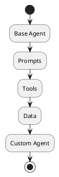
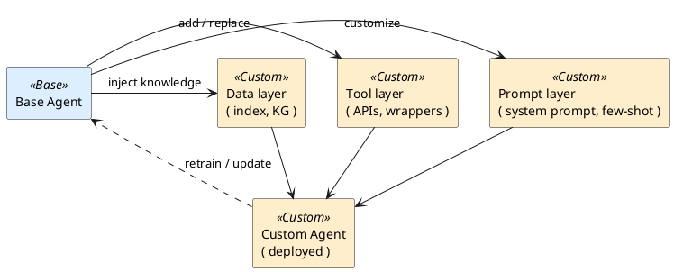

# Review: 12.3: Implementation — Customizing the Agent

**Source:** part-iv/ch12-the-students-artificial-intelligence/lecture-03.adoc

---

## Review of Lecture 12.3 – *Implementation: Customizing the Agent*

### Summary
**Grade: C** – The lecture covers the required material but falls short of a 90‑minute, engaging session. It lacks a compelling hook, the core sections are under‑developed (only 2‑3 paragraphs each), and the philosophical part is missing a key point. The PlantUML diagram is too abstract to reinforce the narrative. Substantial restructuring is needed to give the lecture a clear narrative arc, the right density, and the “wow” factor that keeps students attentive for a full class period.

---

## 1. Narrative Arc  

| Element | Verdict | Comments |
|---------|---------|----------|
| **Hook** | ❌ Weak | The epigraph is nice, but the opening jumps straight into “The student‑ai/agent is generic…”. No concrete scenario, provocative question, or tension is presented. |
| **Development** | ⚠️ Fragmented | The three main blocks (Conceptual Core, Technical Example, Philosophical Reflection) are each a list of bullet points with only a couple of short paragraphs. There is no clear problem → attempted solution → limitation progression. |
| **Closing / Bridge** | ❌ Missing | The lecture ends with discussion prompts and lab prep, but there is no summarising “so‑what” that ties the customization work to the broader course goals or to the next lecture (e.g., evaluation & monitoring). |

**Overall Narrative Verdict:** The lecture does not currently have a strong story line. It reads like a checklist rather than a journey.

---

## 2. Density (Target: 2,500‑3,500 words; 4‑6 paragraphs per main section)

| Section | Paragraphs (actual) | Target | Key‑point count (actual) | Target |
|---------|---------------------|--------|--------------------------|--------|
| Conceptual Core | **2** (≈150‑200 words) | 4‑6 | **7** | 6‑12 |
| Technical Example | **2** (≈130‑180 words) | 2‑3 | **5** | 5‑8 |
| Philosophical Reflection | **2** (≈120‑170 words) | 2‑3 | **4** | 5‑8 |

*Word count is well below the 2,500‑3,500 range (≈600‑700 total).*

**Density Verdict:** The lecture is far too short. Each core section needs at least two more substantive paragraphs, and the philosophical reflection needs one additional key point.

---

## 3. Interest & Engagement  

| Issue | Why it hurts attention | Suggested fix |
|-------|------------------------|---------------|
| **Definition‑first dump** – “The student‑ai/agent is generic…” | Starts with abstract taxonomy, no story. | Open with a *real‑world vignette*: “Imagine a hospital triage bot that can pull a patient’s latest labs, schedule imaging, and draft discharge summaries. The base agent we built in weeks 1‑8 can’t do any of that out of the box…” |
| **Lack of tension** – No problem statement that needs solving. | Students don’t feel a reason to care. | Pose a provocative question: “When does adding a new tool become *over‑engineering*?” or “Can a generic LLM ever replace a specialist system without customization?” |
| **Thin examples** – The technical example is a high‑level to‑do list. | No concrete code or step‑by‑step walk‑through to keep eyes on the screen. | Insert a short code snippet that shows how to register a custom tool (e.g., a `WeatherAPI` wrapper) and how the orchestrator routes a request. |
| **Philosophical reflection too brief** – No link to broader AI ethics or design theory. | Missed opportunity to spark debate. | Add a paragraph linking “situated artifact” to Latour’s actor‑network theory and to current debates on AI accountability. |
| **No forward bridge** – Ends abruptly. | Students may not see the relevance to the next lab or lecture. | Conclude with a “What’s next?” slide: “Tomorrow we’ll evaluate the customized agent’s performance and discuss monitoring in production.” |

---

## 4. Diagram Review  

**Diagram 1 – “Customization points in agent”**  

Current PlantUML:

| Issue | Recommendation |
|-------|----------------|
| **Linear flow** – No indication that *Prompts, Tools, Data* are *customization knobs* rather than sequential steps. | Replace the linear chain with a **central “Base Agent” node** and three **outward arrows** labeled “Prompt layer”, “Tool layer”, “Data layer”. Each arrow should point to a “Customization” box that feeds back into the agent. |
| **Missing labels** – Students cannot tell which element is optional or extensible. | Add **stereotype tags**: `<<prompt>>`, `<<tool>>`, `<<knowledge>>`. |
| **No feedback loop** – Real systems may re‑train or update after deployment. | Add a **dotted arrow** from “Custom Agent” back to “Base Agent” labeled “Iterative refinement / retraining”. |
| **Styling** – Theme “sketchy‑outline” is fine, but the diagram is too sparse to be useful on a slide. | Use **skinparam** to enlarge node fonts, add colour (e.g., light blue for “Base Agent”, orange for customization layers). |
| **Caption mismatch** – Figure caption mentions “customization points”, but the diagram shows a process flow. | Redesign to **explicitly show three customization points** (Prompts, Tools, Data) as *parallel* boxes attached to the base agent. |

**Revised PlantUML sketch (suggested):**

---

## 5. Recommended Revisions (Prioritized)

1. **Create a Hook (30‑45 min)**  
   * Write a 2‑paragraph opening vignette (e.g., a concrete domain like finance or healthcare) that shows the generic agent failing a realistic task. End with a provocative question that the lecture will answer.  
   * Add a slide with a *“Problem → Need for Customization”* diagram (simple before/after picture).

2. **Expand Conceptual Core to 4‑5 paragraphs (~800 words)**  
   * Paragraph 1: Recap the generic agent architecture (high‑level diagram).  
   * Paragraph 2: Define *customization* vs. *extension* with concrete examples.  
   * Paragraph 3: Detail each customization knob (prompts, tools, data) – include a short code snippet for each.  
   * Paragraph 4: Discuss integration constraints (rate limits, latency, security).  
   * Paragraph 5: Summarise design mindset (situated design).

3. **Enrich Technical Example (2‑3 paragraphs, ~600 words)**  
   * Walk through a *real* capstone scenario (e.g., “Legal‑doc summarizer”). Show: (a) gap analysis, (b) adding a custom `LegalSearch` tool, (c) configuring a system prompt, (d) orchestrator routing decision flow.  
   * Include a minimal runnable snippet (Python pseudo‑code) and a screenshot of the orchestrator config.

4. **Add Missing Philosophical Key Point & Expand to 2‑3 paragraphs**  
   * Insert a paragraph linking “situated artifact” to **responsibility & accountability** (who owns the custom tool, data provenance).  
   * Add a fifth key point: *Ethical implications of domain‑specific customization*.

5. **Revise Closing / Bridge**  
   * End with a “Take‑away” slide that ties customization to the upcoming lecture on **Evaluation & Monitoring**.  
   * Pose a forward‑looking question: “How will we know when our custom agent drifts out of its intended context?”

6. **Redesign Diagram 1** (as per the PlantUML suggestion). Ensure the figure appears on the slide **after** the “Customization points” bullet list, with a caption that reads: “Three orthogonal layers where a generic agent is specialized for a domain.”

7. **Inject Interaction**  
   * After the Conceptual Core, run a 5‑minute *pair‑programming* activity: students draft a system prompt for a given domain.  
   * After the Technical Example, have a quick *live demo* (or recorded screencast) of registering a custom tool.

8. **Word‑count Check**  
   * Aim for ~2,800 words total (≈1,200 for Core, 800 for Example, 800 for Reflection). Use the built‑in word‑counter in the authoring tool.

9. **Proofread for Consistency**  
   * Replace “student‑ai/ agent” with “student‑AI agent” throughout.  
   * Align bullet‑point phrasing (start each with a verb or noun consistently).  

---

### Final Note
Implementing the above changes will transform Lecture 12.3 from a terse checklist into a story‑driven, hands‑on session that comfortably fills a 90‑minute class, keeps students intellectually hooked, and provides the depth required for both technical mastery and philosophical insight.