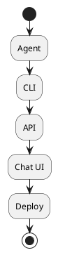

# Review: 12.4: Interface and Deployment

**Source:** part-iv/ch12-the-students-artificial-intelligence/lecture-04.adoc

---

# Review of Lecture 12.4 – *Interface and Deployment*

**Grade: C** – The lecture contains the essential topics but falls short of the 90‑minute, narrative‑driven standard. The hook is weak, the core sections are under‑developed, and the diagram does not reinforce the concepts.

---

## 1. Narrative Arc  

| Element | Assessment | Verdict |
|---------|------------|---------|
| **Hook** | Starts with an epigraph and a list of “Example Prompts”. No concrete scenario, tension, or provocative question that grabs attention. | **Missing** – needs a vivid, relatable opening. |
| **Development** | Moves from a high‑level list of interface options → brief deployment options → a short security note → technical example → philosophical reflection. The progression is more “definition dump → example → reflection” than a problem‑solution‑limit story. | **Weak** – the logical flow is present but not compelling. |
| **Closing / Bridge** | Ends with discussion prompts, lab prep, and a reading link. No explicit bridge to the next lecture or to the lab activity that creates forward momentum. | **Insufficient** – a closing statement that ties the “deployment = commitment” idea to the upcoming capstone would improve cohesion. |

**Overall Narrative Verdict:** The lecture lacks a clear narrative arc. It reads as a checklist rather than a story that builds curiosity, presents a challenge, and resolves it with a forward‑looking implication.

---

## 2. Density (Target 2,500‑3,500 words)

| Section | Approx. Paragraphs | Key‑point Count | Meets Target? |
|---------|-------------------|----------------|---------------|
| Conceptual Core | 2 (≈150‑200 words) | 7 | **No** – needs 4‑6 paragraphs and richer exposition. |
| Technical Example | 2 (≈180 words) | 5 | **Borderline** – okay on paragraph count but light on technical depth (e.g., Dockerfile, CI/CD, logging). |
| Philosophical Reflection | 2 (≈150 words) | 4 | **No** – should be 2‑3 paragraphs with 5‑8 concrete reflection points. |
| Overall word count | ~500‑600 words | – | **Far below** the 90‑minute target. |

**Density Verdict:** The lecture is dramatically under‑sized. It would only fill ~15‑20 minutes of class time.

---

## 3. Interest & Engagement  

| Issue | Why it hurts attention | Suggested fix |
|-------|------------------------|---------------|
| **Definition‑first opening** (epigraph + prompts) | Students hear a quote then a bullet list; no story to hook them. | Open with a *real‑world vignette*: e.g., “Imagine a university‑wide tutoring bot that suddenly crashes when thousands of students try to ask it a question at 8 am…” |
| **Thin conceptual core** | Lists interfaces without illustrating trade‑offs or user personas. | Add a short case study (e.g., “The CS department uses a CLI for batch grading, while the counseling center needs a chat UI”). |
| **Lack of concrete technical depth** | “Run `python main.py`” is too generic; students may not see the steps to production. | Include a minimal Dockerfile, a `docker-compose.yml`, and a note on environment variables, logging, and health‑checks. |
| **Philosophical reflection is abstract** | “The interface shapes encounter” is a good idea but not tied to concrete design decisions. | Pair each philosophical claim with a design pattern (e.g., “Feedback loops → progress bars in chat UI”). |
| **No forward‑looking bridge** | Students finish the lecture without a clear “what’s next”. | End with a teaser: “Next week we’ll explore monitoring and observability—how to know when your deployed agent is silently failing.” |

---

## 4. Diagram Review  

**Current PlantUML (Diagram 1)**  



| Problem | Impact | Concrete Improvement |
|---------|--------|----------------------|
| Linear “start → stop” flow with no arrows or labels. | Gives no sense of *data* or *control* flow; students cannot see how users reach the agent. | Replace with a component diagram: <br>```\n@startuml\npackage "User Layer" {\n  [CLI] as cli\n  [Chat UI] as chat\n  [API Client] as apiClient\n}\npackage "Agent Layer" {\n  [Agent] as agent\n}\npackage "Deployment" {\n  [Docker Container] as container\n  [Cloud (AWS/GCP)] as cloud\n}\ncli --> agent : request\nchat --> agent : request\napiClient --> agent : HTTP POST /ask\nagent --> cli : response\nagent --> chat : response\nagent --> apiClient : JSON\nagent --> container : runs in\ncontainer --> cloud : deployed to\n@enduml``` |
| No indication of **security** (auth, rate‑limit) or **failure handling**. | Misses an opportunity to reinforce the security key points. | Add a “Security Gateway” component with arrows labeled *auth* and *rate‑limit*. |
| No visual distinction between *development* (local) and *production* (cloud). | Students cannot map the “local vs cloud” discussion onto the diagram. | Use different colors or stereotypes (`<<local>>`, `<<cloud>>`) to separate the two deployment options. |
| No feedback loop for *monitoring / logging*. | The “deployment = commitment” idea is not visualized. | Add a “Monitoring” box with a dashed arrow from the agent back to it. |

---

## 5. Recommended Revisions (Prioritized)

1. **Create a compelling hook (30‑40 min).**  
   - Write a 2‑paragraph scenario (e.g., a campus‑wide tutoring bot overwhelmed during exam week).  
   - Pose a provocative question: “How do we make sure the bot stays usable when thousands of students hit it at once?”

2. **Expand the Conceptual Core to 4‑6 paragraphs (~800‑1,000 words).**  
   - Detail each interface type with a concrete persona and use‑case.  
   - Introduce a decision matrix (audience vs latency vs ease of integration).  
   - Discuss trade‑offs (security surface, maintenance burden).  

3. **Enrich the Technical Example (2‑3 paragraphs, ~500 words).**  
   - Provide a minimal Dockerfile, a `docker-compose.yml`, and a CI/CD snippet (GitHub Actions).  
   - Show how to expose the API with FastAPI/Flask and how to add basic auth middleware.  
   - Include a short “debugging checklist” (health‑endpoint, logs, curl test).  

4. **Deepen the Philosophical Reflection (2‑3 paragraphs, ~400 words).**  
   - Link each philosophical claim to a concrete design decision (e.g., “Transparency → show confidence scores in chat UI”).  
   - Add a short “ethical note” about how interface design can bias user expectations.  

5. **Add a closing bridge (1 paragraph).**  
   - Summarize the “deployment = commitment” theme and preview the next lecture on *Monitoring & Observability*.  

6. **Rewrite the diagram (Diagram 1).**  
   - Use the component diagram suggested above.  
   - Label arrows (request/response, auth, rate‑limit).  
   - Distinguish local vs cloud deployment with colors or stereotypes.  

7. **Adjust word count to 2,800‑3,200 words.**  
   - Aim for ~1,200 words in Conceptual Core, ~900 words in Technical Example, ~800 words in Philosophical Reflection.  

8. **Update discussion prompts to align with the new narrative.**  
   - Example: “Given the tutoring‑bot scenario, which interface would you prioritize and why?”  

9. **Add a short “quick‑start” box** (e.g., a 5‑step checklist) that students can copy into their labs.  

10. **Proofread for consistency** (e.g., “CLI” vs “command‑line interface”, “API” vs “REST API”) and ensure all key‑point lists are parallel in style.

---

### Final Thought  

With a stronger opening story, richer technical depth, and a more purposeful diagram, Lecture 12.4 can comfortably fill a 90‑minute session, keep students engaged, and provide a solid bridge to the capstone lab and the next topic on system observability.