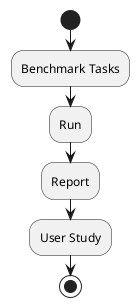
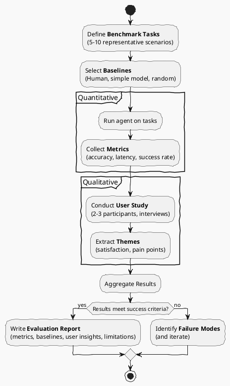

# Review: 12.5: Evaluation and Benchmarking

**Source:** part-iv/ch12-the-students-artificial-intelligence/lecture-05.adoc

---

## Review of Lecture 12.5 – *Evaluation and Benchmarking*

### Summary & Grade
**Grade: C‑**  
The lecture covers the essential ingredients of evaluation, but it falls short of the 90‑minute target in both depth and narrative momentum. The hook is modest, the development is a rapid list‑dump, and the closing does not clearly bridge to the upcoming lab or the next lecture. Paragraph count and key‑point density are below the prescribed ranges, and the sole PlantUML diagram is overly simplistic, offering little visual scaffolding for the concepts.

---

## 1. Narrative Arc  

| Element | Assessment | Verdict |
|--------|------------|---------|
| **Hook** | Starts with a rhetorical question *“How do we know the capstone works?”* – a decent prompt but abstract. No concrete scenario (e.g., a self‑driving car failing a safety test) to create immediate tension. | **Weak** |
| **Development** | Lists evaluation components (metrics, baselines, benchmark tasks, user study, honest reporting) in a linear fashion. The progression *measure → compare → test → reflect* is present but not explicitly staged as a problem → response → limitation sequence. | **Moderate** |
| **Closing / Bridge** | Ends with a philosophical note on “evaluation as argument” and a set of discussion prompts. The lab‑prep section is tacked on after the reflection, so the narrative feels fragmented and does not naturally lead students into Lab 3. | **Weak** |

**Overall Narrative Verdict:** The lecture has a seed of a story but needs a stronger, concrete hook, clearer step‑by‑step problem‑solution framing, and an explicit transition to the lab activity.

---

## 2. Density (Target ≈ 2 500–3 500 words)

| Section | Paragraphs (actual) | Target | Key‑Points (actual) | Target |
|---------|---------------------|--------|---------------------|--------|
| Conceptual Core | **≈ 2** (one long intro + one “User study” paragraph) | 4‑6 | **8** (good) | 6‑12 |
| Technical Example | **≈ 1** (single block) | 2‑3 | **6** (good) | 5‑8 |
| Philosophical Reflection | **≈ 2** | 2‑3 | **4** (short) | 5‑8 |

**Word count** is well under 2 500 words (≈ 1 200). The lecture is therefore too thin to fill a 90‑minute session without extensive instructor elaboration.

---

## 3. Interest & Engagement  

* **Thin sections** – The Technical Example is a single “run the harness” paragraph; students will need many concrete anecdotes or code snippets to stay engaged.  
* **Definition‑first** – The core opens with a definition‑style list (“Metrics: what to measure…”) rather than showing a problem that *requires* those metrics.  
* **Missing tension** – No illustration of a failed evaluation or a “gaming the benchmark” scandal that would spark curiosity.  
* **No forward motion** – After the philosophical reflection, the lab prep appears as a separate bullet list, not as the natural next step of the story.

**Concrete ways to boost interest**  

1. **Start with a vivid case study** (e.g., a chatbot that scores 99 % accuracy on a synthetic benchmark but crashes in real‑world conversations).  
2. **Pose a provocative question**: *“What would convince a skeptical reviewer that your agent truly solves problem X?”* – then let the lecture unfold as the answer.  
3. **Introduce a “failed evaluation” anecdote** (e.g., the ImageNet‑V2 test that revealed overfitting) to illustrate the stakes of good benchmarking.  
4. **Interleave short, interactive mini‑exercises** (e.g., students draft a metric table for a given domain).  
5. **End with a clear bridge**: “In Lab 3 you will apply the evaluation framework you just built to your own capstone project.”

---

## 4. Diagram Review  

**Diagram 1 – “Evaluation framework for capstone”**  

| Issue | Recommendation |
|-------|----------------|
| **Over‑simplified flow** – No distinction between *quantitative* (benchmark) and *qualitative* (user study) paths. |
| **Missing feedback loops** – Real evaluation iterates: results → refine tasks/metrics → re‑run. |
| **No labels for artifacts** – What is being *reported*? Metrics table? Failure analysis? |
| **No representation of baselines** – Benchmarks compare against a baseline; the diagram omits this. |
| **Stylistic** – “sketchy‑outline” theme is fine, but adding colors or icons would improve readability. |

**Improved PlantUML suggestion**

*Adds two parallel partitions (quantitative vs. qualitative).  
*Shows baselines, success‑criteria decision, and an iteration loop for failure handling.  
*Labels each activity with the artifact produced.

---

## 5. Recommended Revisions (Prioritized)

1. **Rewrite the Hook**  
   *Open with a concrete, high‑stakes scenario (e.g., a medical diagnosis AI that passes a benchmark but misdiagnoses a real patient). Pose a provocative question about evidence.*

2. **Expand Conceptual Core to 4‑6 paragraphs**  
   - Paragraph 1: Hook → problem of “trust without evidence”.  
   - Paragraph 2: Metric selection (trade‑offs, domain relevance).  
   - Paragraph 3: Baselines and why they matter (human, random, prior state‑of‑the‑art).  
   - Paragraph 4: Benchmark design (representativeness, avoidance of overfitting).  
   - Paragraph 5: User‑study design (sampling, interview protocol).  
   - Paragraph 6: Honest reporting & failure analysis.

3. **Add a “Failure‑Case” Mini‑Case Study** (≈ 150 words) within the core to create tension and illustrate the cost of poor evaluation.

4. **Enrich Technical Example**  
   - Provide a concrete snippet of a scoring script (pseudo‑code).  
   - Show a sample metric table (accuracy = 78 %, latency = 120 ms).  
   - Include a short “what‑if” analysis (e.g., metric shows high accuracy but user study reveals frustration).

5. **Boost Philosophical Reflection to 5‑8 key points**  
   - Add points on *reproducibility*, *statistical significance*, *ethical implications of over‑claiming*, *peer review expectations*, and *open data*.

6. **Insert a clear transition to Lab 3** at the end of the reflection: “Next, you will operationalise this framework in Lab 3, turning the abstract design into a concrete evaluation of your own capstone.”

7. **Replace the current PlantUML diagram** with the improved version above (or a similarly detailed flowchart). Ensure the diagram is referenced in the text (“see Figure 12.5”) and that each block is discussed.

8. **Add a 5‑minute “Think‑Pair‑Share” activity** after the discussion prompts to keep the 90‑minute session interactive.

9. **Check word count** – expand sections to reach ~2 800 words (≈ 1 200 words added across core and examples).

---

### Final Note
Implementing the above changes will transform Lecture 12.5 from a terse checklist into a compelling, story‑driven session that fills a 90‑minute class, engages students with real‑world stakes, and equips them with a concrete evaluation workflow they can immediately apply in Lab 3.