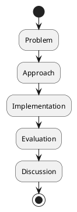
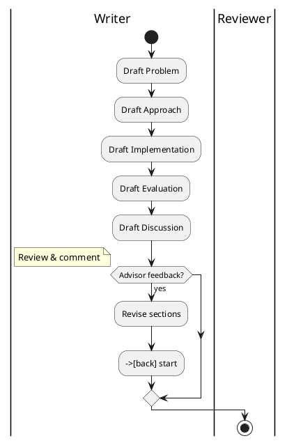

# Review: 12.6: The Written Thesis

**Source:** part-iv/ch12-the-students-artificial-intelligence/lecture-06.adoc

---

## Review of Lecture 12.6 – “The Written Thesis”

### Summary  
**Grade: D** – The lecture is far too thin for a 90‑minute session. It opens with a nice epigraph but lacks a concrete hook or narrative tension, and the “Conceptual Core” is essentially a definition dump. The total word count is well under 1 000 words, far short of the 2 500‑3 500‑word target, and the structure provides only a single linear flowchart that does not illustrate the iterative nature of thesis writing. Substantial re‑working is required to give the lecture a compelling arc, enough depth, and engaging activities.

---

## 1. Narrative Arc  

| Element | Verdict | Comments / Suggested Fix |
|---------|---------|--------------------------|
| **Hook** | ❌ Weak | The epigraph is literary but does not create a problem or curiosity for the students. Start with a vivid scenario (e.g., “You’ve just finished a working prototype that could reduce hospital readmission rates by 15 %. Your advisor asks: ‘Can you convince anyone else that this works?’”) or a provocative question (“What if your thesis were rejected tomorrow—what would that mean for your career?”). |
| **Development** | ⚠️ Minimal | The lecture jumps straight into a list of sections and bullet points. There is no step‑by‑step story of *why* each section matters, no illustration of the feedback loop between design, implementation, and writing, and no tension (e.g., trade‑offs between depth and brevity). Insert a short case study of a past student’s thesis, highlighting a specific pain point (missing reproducibility details) and how the writing process solved it. |
| **Closing / Bridge** | ❌ Absent | The “Discussion Prompts” are useful but feel tacked on. End with a forward‑looking statement that ties the thesis to the upcoming lab (e.g., “In the next lab you will turn the outline you just drafted into a full manuscript, and we’ll practice the reviewer‑response cycle that every graduate must survive”). This gives a clear purpose for the next session. |

**Overall Verdict:** The lecture lacks a clear narrative arc. It needs a concrete opening, a progressive development that shows the *problem → attempted solution → limitation → next step* pattern, and a closing that explicitly connects to the lab or the next lecture.

---

## 2. Density (Target ≈ 2 500‑3 500 words)

| Section | Approx. Paragraphs | Approx. Key‑point bullets | Word‑count estimate |
|---------|-------------------|---------------------------|---------------------|
| Conceptual Core | 1 (large block) | 8 | ~250 |
| Technical Example | 1 (outline) | 4 | ~150 |
| Philosophical Reflection | 2 | 5 | ~180 |
| **Total** | **≈ 4** | **≈ 17** | **≈ 580** |

**Result:** The lecture falls dramatically short of the required density. It needs **4‑6 well‑developed paragraphs** in the Conceptual Core, **2‑3 paragraphs** with **5‑8 concrete technical points** in the Example, and **2‑3 paragraphs** with **5‑8 reflective points** in the Philosophical Reflection. In practice, expand each section with:

* concrete anecdotes,
* step‑by‑step reasoning,
* illustrative data (e.g., a table of typical thesis page limits per section),
* short excerpts from exemplary thesis passages.

---

## 3. Interest  

| Issue | Why it hurts engagement | Quick remedy |
|-------|------------------------|--------------|
| Definition‑first dump | Students hear “here’s a list” and disengage. | Begin with a story or a “what if” scenario that forces them to care about the structure. |
| No interactive tension | No decision points, no conflict. | Pose a dilemma (“You have 30 pages for the evaluation. Do you include raw user logs or a concise statistical summary?”) and ask them to argue both sides. |
| Thin technical example | Only an outline; no concrete artifact. | Show a real snippet of a thesis figure (e.g., a system architecture diagram) and walk through how it was generated. |
| Lack of visual variety | Only one linear flowchart. | Add a timeline diagram, a feedback‑loop diagram, and a “reader‑persona” map. |
| Lab instructions are restated, not expanded | Students may feel the lecture is redundant with the lab handout. | Use the lab as a *live* activity: have students draft a one‑paragraph problem statement in class and peer‑review it. |

---

## 4. Diagram Review  

**Diagram 1 – “Thesis structure template”**  

| Assessment | Comments |
|------------|----------|
| **Relevance** | The diagram matches the linear list of sections, but it does **not** reflect the iterative nature of thesis writing (draft → review → revise). |
| **Clarity** | Labels are fine, but the flow is too simplistic; students may think the thesis is a one‑pass process. |
| **Suggested improvements** | <ul><li>Add a **feedback loop** from each section back to “Problem” or “Approach” to show revision cycles.</li><li>Insert a **parallel branch** for “Appendix / Supplementary Material”.</li><li>Label the arrows with verbs (“draft”, “review”, “revise”).</li><li>Use a **swim‑lane** style to differentiate “Writer actions” vs. “Reviewer actions”.</li></ul> Example PlantUML sketch:  

This visualizes the **iterative loop** that the lecture should emphasize.

---

## 5. Recommended Revisions (Prioritized)

1. **Create a strong opening hook**  
   * Write a 2‑paragraph vignette of a student whose prototype works but whose thesis is rejected for lack of reproducibility. End with a provocative question that the lecture will answer.

2. **Expand the Conceptual Core to 4‑6 paragraphs**  
   * Paragraph 1: Why a thesis matters beyond a grade (career, scientific record).  
   * Paragraph 2: The “problem → approach → implementation → evaluation → discussion” as a *design cycle*, not a static list.  
   * Paragraph 3: Reproducibility checklist (data, code, environment).  
   * Paragraph 4: The role of citations and figures (show a tiny excerpt of a good figure).  
   * Optional Paragraph 5: Common pitfalls (over‑detail, under‑detail).  

3. **Enrich the Technical Example**  
   * Provide a **real excerpt** (≈150 words) from a high‑quality thesis abstract and dissect it line‑by‑line.  
   * Add a short **table** of typical page limits per section for a 30‑page thesis.  
   * Include a mini‑exercise: students write a 150‑word “Problem” paragraph on the spot.

4. **Deepen the Philosophical Reflection**  
   * Connect “writing = thinking” to cognitive research (e.g., “The ‘generation effect’ shows that writing improves recall”).  
   * Discuss the ethical dimension of public claims (responsibility, reproducibility crisis).  
   * Pose a reflective prompt: “If you could only keep one paragraph of your thesis forever, what would it say?”

5. **Redesign the diagram** (see above) to show **iteration**, **feedback**, and **multiple audiences** (advisor, committee, future readers). Add a second diagram: a **reader‑persona map** (faculty, industry peer, future self) with arrows indicating which sections matter most to each.

6. **Integrate active learning**  
   * 10‑minute “pair‑write” of a problem statement.  
   * 5‑minute “gallery walk” where pairs critique each other’s drafts using a rubric.  
   * 5‑minute “think‑pair‑share” on the discussion prompts.

7. **Bridge to the lab**  
   * End with a concise “Next‑step” paragraph: “In Lab 3 you will turn today’s outline into a 2‑page draft, submit it for peer review, and practice responding to reviewer comments.”  

8. **Word‑count check**  
   * After revisions, run a word count; aim for **≈ 2 800 words** across the three main sections.

---

### Closing Note  
With the above changes, Lecture 12.6 will transform from a skeletal checklist into a **story‑driven, interactive session** that not only tells students *what* a thesis looks like, but also *why* each component matters, *how* the writing process shapes the research, and *what* they will do next in the lab. This will meet the 90‑minute depth requirement and keep students engaged throughout.