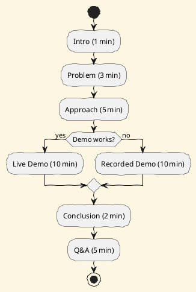

# Review: 12.7: The Formal Presentation

**Source:** part-iv/ch12-the-students-artificial-intelligence/lecture-07.adoc

---

# Review of Lecture 12.7 – “The Formal Presentation”

**Grade: C** – The material covers the required content but falls short of the 90‑minute, narrative‑driven, engaging format expected for an AIPA lecture. The lecture is too terse, lacks a compelling hook, and does not meet the word‑count or paragraph‑count targets for the three main sections.

---

## 1. Narrative Arc  

| Element | Verdict | Comments |
|---------|---------|----------|
| **Hook** | ❌ Weak | The lecture opens with an epigraph and a bland statement “Present the capstone”. No concrete scenario, provocative question, or tension is introduced. |
| **Development** | ❌ Incomplete | The *Conceptual Core* is a single block‑paragraph that lists format items without framing a problem (e.g., “students must convince a skeptical audience”) and without showing a step‑by‑step response or emerging limits. |
| **Closing / Bridge** | ❌ Minimal | The “Lab Prep” and “Discussion Prompts” are tacked on; there is no narrative payoff that ties back to the hook or signals the next lecture/lab. |
| **Overall Arc** | ❌ | The lecture reads like a checklist rather than a story with rising tension, a climax (the demo), and a resolution (reflection on accountability). |

**Suggested Hook (to be added at the very start)**  
> *“You’ve spent months building an autonomous negotiation agent. The day of the capstone arrives, the projector flickers, and the audience—your professor, a venture‑capitalist, and a skeptical peer—waits. Will your live demo survive the pressure, or will you have to fall back on a pre‑recorded video? What does that moment tell us about the nature of presenting AI work?”*  

This scenario creates immediate stakes, invites empathy, and sets up the central problem: **how to design a presentation that works under uncertainty**.

---

## 2. Density (Target ≈ 2,500‑3,500 words)

| Section | Current Paragraphs | Target Paragraphs | Current Key‑Points | Target Key‑Points |
|---------|-------------------|-------------------|--------------------|-------------------|
| Conceptual Core | 1 | 4‑6 | 8 | 6‑12 |
| Technical Example | 1 | 2‑3 | 5 | 5‑8 |
| Philosophical Reflection | 1 | 2‑3 | 4 | 5‑8 |

**Word count estimate:** ~350 words total (≈ 15 % of the required range).  

**Conclusion:** The lecture is dramatically under‑dense. Each main section needs to be expanded with multiple paragraphs, richer explanations, and more concrete bullet points.

---

## 3. Interest & Engagement  

| Issue | Why it hurts attention | Quick fix |
|-------|------------------------|-----------|
| **Definition‑first dump** (e.g., “Presentation format: duration, structure, demo”) | Learners hear a list before they care why it matters. | Start each list with a *why* (e.g., “Why a 20‑minute limit? Because attention spans drop sharply after 15 min”). |
| **Thin sections** (single‑paragraph blocks) | No room for anecdotes, questions, or interactive moments. | Insert a short case study (e.g., a student whose live demo crashed and how the fallback saved the presentation). |
| **Lack of active learning prompts** | 90 min sessions need pauses for discussion, mini‑exercises, or live demos. | After the “Structure suggestion” paragraph, ask students to draft a 3‑slide outline in pairs and share. |
| **No tension or conflict** | Without a problem to solve, the material feels procedural. | Frame the demo as a high‑risk “performance” and ask: “What would you do if the robot stopped moving halfway?” |

---

## 4. Diagram Review  

**Figure 12.7 – Presentation outline (PlantUML)**  

Current diagram: a linear flowchart (Intro → Problem → Approach → Demo → Conclusion).  

**Problems**  
1. No indication of **timing** or **decision points** (e.g., what if the demo fails?).  
2. No feedback loop to **Q&A** or **fallback**.  
3. Lacks labels for **duration** or **audience interaction**.

**Suggested improvements**  

*Add a decision diamond for “Demo works?” and annotate each step with the suggested minutes. Include an arrow from Q&A back to “Approach” to hint at future work or audience‑driven iteration.*

---

## 5. Recommended Revisions (Prioritized)

1. **Insert a compelling hook** (scenario or provocative question) at the very start; tie it to the “performance” theme.
2. **Expand the Conceptual Core** to 4‑6 paragraphs:
   - Paragraph 1: The problem (students must convince a mixed audience under time pressure).
   - Paragraph 2: The stakes (visibility, accountability, career implications).
   - Paragraph 3: The response (designing a resilient presentation structure).
   - Paragraph 4: Limits & trade‑offs (depth vs. accessibility, live vs. recorded demo).
3. **Add concrete examples** (real or fictional case studies) throughout the three main sections to illustrate each point.
4. **Increase Key‑Point lists** to meet the 6‑12 range, grouping them under sub‑headings (e.g., “Timing”, “Audience Management”, “Technical Safeguards”).
5. **Insert at least two active‑learning activities**:
   - Pair‑draft a 3‑slide outline and critique each other’s timing.
   - Role‑play a Q&A where one student is a skeptical stakeholder.
6. **Rewrite the Technical Example** into 2‑3 paragraphs, showing a step‑by‑step rehearsal workflow, a “what‑if” failure scenario, and a debrief.
7. **Deepen the Philosophical Reflection** to 2‑3 paragraphs, linking performance theory, the public nature of AI research, and ethical accountability.
8. **Revise Figure 12.7** as per the PlantUML suggestion: add decision node, timing labels, and a Q&A loop.
9. **Add a closing bridge** that explicitly points to the next lab or lecture (e.g., “In Lab 3 you will record a backup demo and practice handling tough questions; next week we’ll discuss how to write a compelling research paper based on the same material.”).
10. **Check word count** after revisions; aim for ~2,800 words total across the three main sections.

---

**Final Note:** By turning the lecture from a checklist into a story of “the high‑stakes capstone performance,” adding concrete examples, interactive moments, and a richer diagram, the material will fill the 90‑minute slot, keep students engaged, and meet the AIPA quality standards.