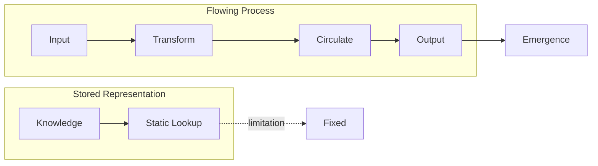

# Definitions of Intelligence — Stored vs. Flowing

> "The problem is not that people do not know the truth, but that they do not know that they do not know it."
> — Michel Foucault (adapted)

---
layout: default
---

# Conceptual Core

- Stored-representation view: intelligence as knowledge inside a system
- Process view: intelligence as transformation and circulation
- Turing test: behavioral criterion, not a definition of mind

---
layout: default
---

# Conceptual Core (continued)

- Chinese Room: symbols vs. understanding—where does meaning reside?
- Neither view is obviously wrong; real systems mix both
- Expert systems (stored) vs. connectionist (process) vs. modern hybrids

---
layout: default
---

# Conceptual Core (continued)

- Why the distinction matters: design choices shape behavior, cost, and access
- Hybrid example: LLMs store parameters, but behavior emerges from forward pass and attention

---
layout: default
---

# Technical Example

- Lookup table: precomputed answers, retrieval only
- Search: rules + state space + heuristic, compute on demand
- Chess endgame: tablebase (stored) vs. engine search (process)

---
layout: default
---

# Technical Example (continued)

- Tradeoff: storage vs. computation; neither is universally better
- Endgame tablebases are real—tiny state spaces, perfect play
- Knowledge graphs: stored structure (nodes, edges) + flow (traversal, query)

---
layout: default
---

# Technical Example (continued)

- "Which is smarter?"—misplaced; we care about behavior, cost, and scalability

---
layout: default
---

# Philosophical Reflection

- Knowledge as fluid: circulation, consumption, production
- Epistemic circulation: who produces, who consumes, who governs?
- Foucault's episteme: conditions that make knowledge possible

---
layout: default
---

# Philosophical Reflection (continued)

- AI as epistemic machine: formation, storage, circulation of knowledge
- Stored = concentrated; process = distributed—design shapes power
- The diagram: left = static lookup; right = intake, transform, circulate, output

---
layout: default
---

# Discussion Prompts

- Where would you place a retrieval-augmented chatbot: stored or flowing?
- Can a system be intelligent without any stored representation?
- How does the Chinese Room argument change if we add time and memory?

---
layout: default
---

# Discussion Prompts (continued)

- In your experience, when has "more storage" helped vs. "more computation"?
- Who governs epistemic circulation in an LLM-powered search engine?
- If intelligence is flowing, can we "own" it? What are the implications?

---
layout: default
---

# Diagram

---
layout: default
---

# Lab Prep

- Lab 0: documentation stack—Markdown + PlantUML from the Student LLM
- Lab 1–3: knowledge graphs as hybrids (nodes, edges + traversal, query)
- Before Lab 1: representation and process are dimensions, not opposites

---
layout: default
---

# Lab Prep (continued)

- Think ahead: where does your graph store vs. compute? Where does it flow?

---
layout: center
---

# Questions?
