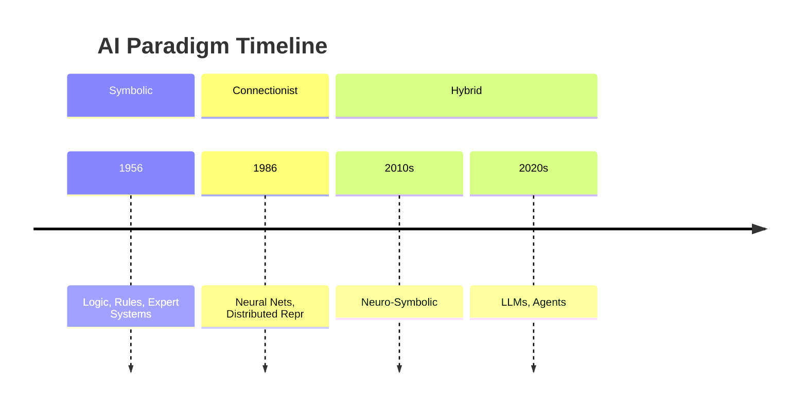

# History of AI — Symbolic, Connectionist, Hybrid

> "There is nothing outside the text."
> — Jacques Derrida

---
layout: default
---

# Conceptual Core

- Symbolic AI: logic, rules, expert systems—knowledge as explicit structures
- Connectionist AI: neural nets, distributed representation—knowledge as weights
- Expert systems (1980s): MYCIN, XCON; limits led to AI winter

---
layout: default
---

# Conceptual Core (continued)

- Connectionism revived: backpropagation, learning from data
- Cycles of optimism and winter—narratives of progress, not linear advancement
- Hybrid architectures: LLMs + retrieval, tools, reasoning—symbolic structure returns

---
layout: default
---

# Conceptual Core (continued)

- Knowledge graphs: symbolic structure (nodes, edges) + connectionist embedding
- No paradigm is purely one or the other; we combine in practice

---
layout: default
---

# Technical Example

- Expert system: rules, traceable inference, interpretable but brittle
- Neural classifier: learned from data, generalizes but opaque
- Neuro-symbolic: knowledge graph (symbolic) + embedding (connectionist) + generation

---
layout: default
---

# Technical Example (continued)

- Retrieval augments generation; symbolic structure constrains output
- Your knowledge graph: symbolic structure, ready for connectionist retrieval

---
layout: default
---

# Philosophical Reflection

- Grand narratives of AI progress: seductive but incomplete
- Lyotard: incredulity toward meta-narratives—each paradigm has limits
- Symbolic never died; connectionist added a layer

---
layout: default
---

# Philosophical Reflection (continued)

- The myth of "one true approach" obscures hybrid reality
- Derrida: representation is trace, mediation—no direct access to world
.Figure 1.2: Timeline — AI paradigms and overlaps
[mermaid,ch01-l02,png]
....
timeline
  title AI Paradigm Timeline
  section Symbolic
    1956 : Logic, Rules, Expert Systems
  section Connectionist
    1986 : Neural Nets, Distributed Repr
  section Hybrid
    2010s : Neuro-Symbolic
    2020s : LLMs, Agents
....

---
layout: default
---

# Discussion Prompts

- When have you encountered a system that felt "symbolic" vs. "connectionist"? What was the difference?
- Why do AI winters happen? What would it take to avoid the next one?
- Where does a retrieval-augmented LLM sit: symbolic, connectionist, or hybrid?

---
layout: default
---

# Discussion Prompts (continued)

- Is "interpretability" a symbolic virtue, or can connectionist systems be interpretable?
- How does the knowledge graph you will build fit the symbolic/connectionist spectrum?

---
layout: default
---

# Diagram

---
layout: default
---

# Lab Prep

- Knowledge graph schema: symbolic (nodes, edges, properties)
- Data ingestion: may come from neural extraction or human curation
- Later: embeddings and retrieval add connectionist layer

---
layout: default
---

# Lab Prep (continued)

- Draw the boundary: where symbolic ends, where connectionist begins
- Lab 1: Data Model and Ingestion—first deliverable

---
layout: center
---

# Questions?
