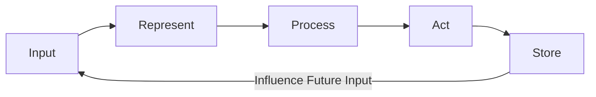

# The Cognitive Turn — Minds as Information Processors

> "The map is not the territory."
> — Alfred Korzybski (via Deleuze's cartography)

---
layout: default
---

# Conceptual Core

- Cognitivism: mind as computation over representations
- Physical symbol system hypothesis (Newell & Simon): symbols sufficient for intelligence
- Information-processing psychology: sense, represent, process, act, store

---
layout: default
---

# Conceptual Core (continued)

- Limits of the computational metaphor: embodiment, situated cognition
- Embodiment: we think with bodies, in environments
- Situated cognition: intelligence from agent–world coupling, not just internal representation

---
layout: default
---

# Conceptual Core (continued)

- Korzybski: the map is not the territory—model vs. lived experience

---
layout: default
---

# Technical Example

- Production systems: if-then rules over working memory
- ACT-R, Soar: symbolic cognitive architectures
- Transparency: we can trace which rules fired

---
layout: default
---

# Technical Example (continued)

- Knowledge graph traversal: explicit rules (if user asks X, traverse Y)
- Neural retrieval: learned, not inspectable
- Your explorer: explicit traversal + later learned retrieval

---
layout: default
---

# Technical Example (continued)

- Pipeline: input → represent → process → act → store

---
layout: default
---

# Philosophical Reflection

- Does computation exhaust cognition? Unsettled
- What gets left out: qualia, embodiment, context, the social
- We need not resolve the issue to build useful systems

---
layout: default
---

# Philosophical Reflection (continued)

- Knowledge graph: representational artifact, supports cognition
- The map is not the territory—but we need maps to navigate
.Figure 1.3: Information-processing as circulation (loop, not pipeline)
[plantuml,ch01-l03,png,theme=sketchy-outline]
....
@startuml
start
:Input;
:Represent;
:Process;
:Act;
:Store;
note right: Influence Future Input
stop
@enduml
....

---
layout: default
---

# Discussion Prompts

- Have you ever felt that a computational model of mind was "missing something"? What?
- Where does your knowledge graph explorer sit in the cognitive pipeline: input, representation, process, or store?
- Can a system without a body be intelligent? What would count as evidence?

---
layout: default
---

# Discussion Prompts (continued)

- Is transparency (being able to trace reasoning) always a virtue? When might it be a cost?

---
layout: default
---

# Diagram

---
layout: default
---

# Lab Prep

- Graph = store; query = input; traversal = process; results = output
- Sketch query flow: input → process → output
- Lab 2: Query and Traversal—where processing happens

---
layout: default
---

# Lab Prep (continued)

- Lab 3: Explorer interface—where system meets user

---
layout: center
---

# Questions?
