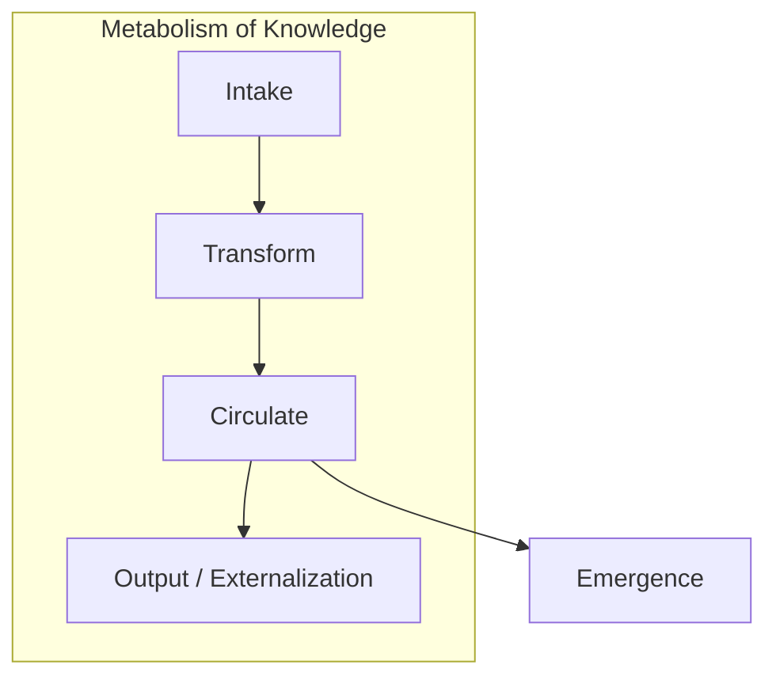

# Intelligence as Metabolism — The Book's Thesis

> "Power is exercised through networks."
> — Michel Foucault

---
layout: default
---

# Conceptual Core

- Metabolism metaphor: intake, transform, circulate, excrete
- Intelligence as flow, not accumulation
- In AI: intake (query, data); transform (retrieval, inference); circulate (layers, users); excrete (discard, archive)

---
layout: default
---

# Conceptual Core (continued)

- Knowledge flow: who produces, who consumes, who governs?
- Contrast: "brain in a vat" vs. metabolic circuit
- Intelligence emerges from: transformation, circulation, representation, integration, action

---
layout: default
---

# Conceptual Core (continued)

- RAG: inherently metabolic—query triggers retrieval → generation → output

---
layout: default
---

# Technical Example

- RAG pipeline: query → retrieval (intake) → generation (transform) → response (output)
- Knowledge lives nowhere static—it flows through store, model, output, user
- User feedback may retrain or update—closes the loop

---
layout: default
---

# Technical Example (continued)

- Your explorer: ingest (intake), traverse (transform), surface (circulate), extend (feedback)
- Design data flow: what enters, what transforms, what exits

---
layout: default
---

# Philosophical Reflection

- Emergence: behavior not explicitly programmed; whole exceeds parts
- In metabolism: emergence from feedback and circulation
- Agency without a single locus—intelligence distributed across circuit

---
layout: default
---

# Philosophical Reflection (continued)

- Foucault: power through networks; intelligence, too
- Your graph participates in intelligent circuit; optimize for flow
.Figure 1.4: Metabolism of knowledge (flow diagram)
[plantuml,ch01-l04,png,theme=sketchy-outline]
....
@startuml
|Metabolism of Knowledge|
start
:Intake;
:Transform;
:Circulate;
split
  :Output / Externalization;
split again
  :Emergence;
end split
stop
@enduml
....

---
layout: default
---

# Discussion Prompts

- Where would you locate "intelligence" in a RAG pipeline—retrieval, generation, or the loop?
- Can a system be intelligent without any feedback loop? What would that mean?
- How does the metabolism metaphor change how you think about "storing" knowledge?

---
layout: default
---

# Discussion Prompts (continued)

- Who governs the metabolic circuit in an LLM-powered application?

---
layout: default
---

# Diagram

---
layout: default
---

# Lab Prep

- Map: intake, transform, circulate, feedback
- Lab 2: Query and Traversal—transform step
- Lab 3: Explorer—circulate and feedback

---
layout: default
---

# Lab Prep (continued)

- Sketch the flow before implementing

---
layout: center
---

# Questions?
