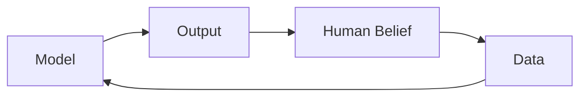

# Epistemic Machines — AI as Knowledge Producers

> "Discourse is not simply that which translates struggles or systems of domination, but is the thing for which and by which there is struggle."
> — Michel Foucault

---
layout: default
---

# Conceptual Core

- Epistemic machines: create, validate, distribute knowledge
- AI produces categories, predictions, texts—not just retrieves
- Feedback loop: model output shapes belief → shapes behavior → shapes data → shapes model

---
layout: default
---

# Conceptual Core (continued)

- From "tool" to "participant": recommendation systems create preferences
- Generative AI: produces texts that become part of epistemic landscape
- Delegation of epistemic authority to machines—already widespread

---
layout: default
---

# Conceptual Core (continued)

- Design challenge: support human judgment, not undermine it

---
layout: default
---

# Technical Example

- Recommendation systems: shape preferences, create categories
- Epistemic loop: recommendations → choices → data → recommendations
- Generative AI: output circulates, becomes part of infrastructure

---
layout: default
---

# Technical Example (continued)

- Synthetic data: inside the loop, not outside
- Your explorer: what gets in? Who benefits? Epistemic questions

---
layout: default
---

# Philosophical Reflection

- Epistemic authority: historically institutions, experts, communities
- AI: algorithms rank, filter, generate—delegation often implicit
- Accountability: delegated without explicit transfer

---
layout: default
---

# Philosophical Reflection (continued)

- Knowledge graph: epistemic act—you decide what matters
- Design for contestation, not just consumption
.Figure 1.5: Epistemic feedback loop
[plantuml,ch01-l05,png,theme=sketchy-outline]
....
@startuml
start
:Model;
:Output;
:Human Belief;
:Data;
:Model;
stop
@enduml
....

---
layout: default
---

# Discussion Prompts

- Can you think of a time when an algorithm shaped what you believed or preferred?
- Who should be accountable when an AI system produces misleading "knowledge"?
- What would it mean to design a knowledge graph "for contestation"?

---
layout: default
---

# Discussion Prompts (continued)

- How does your explorer differ from a recommendation system in its epistemic role?

---
layout: default
---

# Diagram

---
layout: default
---

# Lab Prep

- Schema (Lab 1): what can be represented
- Queries (Lab 2): what can be retrieved
- Interface (Lab 3): how it is presented

---
layout: default
---

# Lab Prep (continued)

- Each layer is an epistemic choice
- Who is the user? What decisions? What might be missing?

---
layout: center
---

# Questions?
