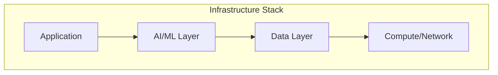

# Infrastructural Intelligence — Systems in Context

> "Technology is the answer. But what was the question?"
> — Cedric Price (via Bruno Latour)

---
layout: default
---

# Conceptual Core

- Infrastructure: that which enables other activity
- AI as invisible substrate: search, translation, moderation
- Invisible until it breaks—visibility is politicization

---
layout: default
---

# Conceptual Core (continued)

- Latour: technology as frozen (delegated) social relations
- When infrastructure fails: bias, error, wrong removal—governance becomes urgent
- Make infrastructure legible: surface dependencies, trace failures

---
layout: default
---

# Technical Example

- One model: application, data layer, compute, training pipeline
- Model drift: inputs shift, performance degrades
- What breaks: recommendations, trust, stakeholders harmed

---
layout: default
---

# Technical Example (continued)

- Dependency map is social: biases, metrics, deployment decisions
- Your graph: applications depend on schema, quality, query performance
- Sketch the stack: application, knowledge layer, data, users

---
layout: default
---

# Philosophical Reflection

- Infrastructural power: conditioning, not sovereignty
- Diffuse, embedded, often invisible
- Invisible systems escape democratic oversight

---
layout: default
---

# Philosophical Reflection (continued)

- Legibility: audit trails, dependency maps, impact assessments
- Diagram: application → AI/ML → data → compute
.Figure 1.6: AI in infrastructure stack
[plantuml,ch01-l06,png,theme=sketchy-outline]
....
@startuml
|Infrastructure Stack|
start
:Application;
:AI/ML Layer;
:Data Layer;
:Compute/Network;
stop
@enduml
....

---
layout: default
---

# Discussion Prompts

- When has AI infrastructure become "visible" to you? What triggered the visibility?
- Who should be responsible when infrastructure fails—designers, deployers, or organizations?
- How would you map the dependencies for a system you use daily?

---
layout: default
---

# Discussion Prompts (continued)

- What does "infrastructure" mean for your knowledge graph project?

---
layout: default
---

# Diagram

---
layout: default
---

# Lab Prep

- Ch2 audit tool: will map dependencies
- Your graph: where in the stack? What builds on it?
- What breaks: incomplete, slow, biased

---
layout: default
---

# Lab Prep (continued)

- Lab 3 Explorer: infrastructure for users
- Sketch: graph, sources, consumers, failure modes

---
layout: center
---

# Questions?
