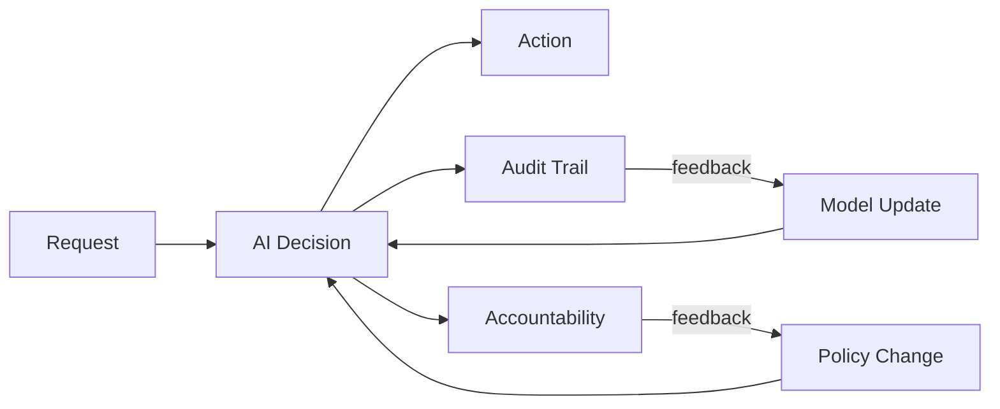

# Institutional Participation — AI in Organizations

> "The individual is an effect of power."
> — Michel Foucault

---
layout: default
---

# Conceptual Core

- AI as participant in institutional knowledge practices
- Decision support vs. delegation: inform vs. act
- In practice: line is blurry; rubber-stamping, deference

---
layout: default
---

# Conceptual Core (continued)

- Accountability and traceability: who is responsible when the system errs?
- From tool to actor: AI shapes what gets decided, how, by whom
- Audit trails: request, return, action, approval

---
layout: default
---

# Conceptual Core (continued)

- Governance loop: audit, update, accountability, policy

---
layout: default
---

# Technical Example

- Loan approval: system scores, officer decides—who is accountable?
- Many hands problem: responsibility distributed
- Content moderation: filter + moderators + policy—accountability complex

---
layout: default
---

# Technical Example (continued)

- Audit trails: record what system did, what human did
- Accountability: not just recording—assignment
- Your Explorer: surface institutional context (who, when, constraints)

---
layout: default
---

# Philosophical Reflection

- Responsibility gap: no one accountable when automated system harms
- Design choice: human-in-the-loop, audit trails, explicit assignment
- Many hands: organizations benefit from diffusion; harmed seek target

---
layout: default
---

# Philosophical Reflection (continued)

- Legal frameworks evolving: EU AI Act, sector rules, liability
- Design for auditability: traceable decisions, documented rationale
.Figure 1.7: AI in institutional decision flow (governance-as-loop)
[plantuml,ch01-l07,png,theme=sketchy-outline]
....
@startuml
start
:Request;
:AI Decision;
:Action;
fork
  :Audit Trail;
  :Model Update;
fork again
  :Accountability;
  :Policy Change;
end fork
:AI Decision;
stop
@enduml
....

---
layout: default
---

# Discussion Prompts

- Have you encountered a "responsibility gap"—harm from a system with no clear accountable party?
- How would you assign accountability in a loan approval system? A content moderator?
- What would "design for auditability" mean for your knowledge graph explorer?

---
layout: default
---

# Discussion Prompts (continued)

- Should some decisions never be delegated to AI? Which ones?

---
layout: default
---

# Diagram

---
layout: default
---

# Lab Prep

- Lab 3: Explorer—surface institutional context
- Metadata: provenance (source, date), authority (creator), constraints (license)
- Context supports accountability

---
layout: default
---

# Lab Prep (continued)

- Design schema and queries with Explorer in mind

---
layout: center
---

# Questions?
