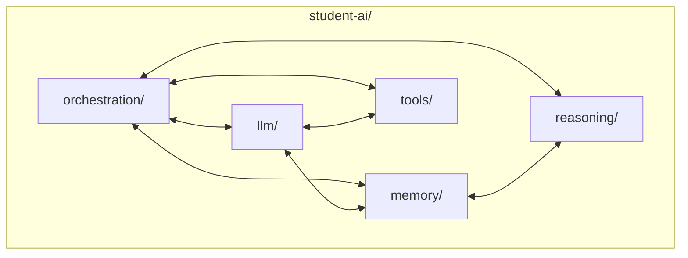

# The Student's AI — Capstone Vision

> "A line of flight: an absolute deterritorialization."
> — Gilles Deleuze

---
layout: default
---

# Conceptual Core

- Capstone vision: build an AI agent across 12 chapters
- student-ai/ structure: llm/, memory/, reasoning/, tools/, orchestration/
- Each chapter contributes one tool or module

---
layout: default
---

# Conceptual Core (continued)

- Ch1→knowledge graph (memory foundation); Ch2→audit; Ch3→search; etc.
- The book mirrors the system being built
- Recursive pedagogy: learn AI by building AI

---
layout: default
---

# Conceptual Core (continued)

- Your AI—yours; reflects your decisions

---
layout: default
---

# Technical Example

- student-ai/: orchestration/, llm/, memory/, reasoning/, tools/
- Knowledge graph → memory/; audit → tools/; search → tools/search/
- Flow: user → orchestrator → tool invocation → synthesis → response

---
layout: default
---

# Technical Example (continued)

- Agency from interaction, not hierarchy
- Lab 1: Data Model and Ingestion—first deliverable

---
layout: default
---

# Philosophical Reflection

- Recursive pedagogy: object and means of study are the same
- Practical and conceptual knowledge reinforce each other
- Passive consumption vs. active construction—different understanding

---
layout: default
---

# Philosophical Reflection (continued)

- Your agent: extend, critique, deploy
- Line of flight: deterritorialization from the default
.Figure 1.8: student-ai/ architecture — agency from interaction, not hierarchy
[plantuml,ch01-l08,png,theme=sketchy-outline]
....
@startuml
|student-ai/|
start
:orchestration/;
:llm/;
:memory/;
:reasoning/;
:tools/;
stop
@enduml
....

---
layout: default
---

# Discussion Prompts

- What would "your" AI do differently from existing systems?
- Why might building an AI teach more than using one?
- Where do you want your student-ai/ to "fly"—what would success look like?

---
layout: default
---

# Discussion Prompts (continued)

- How does the capstone vision change how you read the rest of the book?

---
layout: default
---

# Diagram

---
layout: default
---

# Lab Prep

- Lab 1: Data Model and Ingestion—define schema, load data
- Schema choices constrain Explorer and memory layer
- Design for integration: graph → student-ai/memory/

---
layout: default
---

# Lab Prep (continued)

- First step of the capstone

---
layout: center
---

# Questions?
