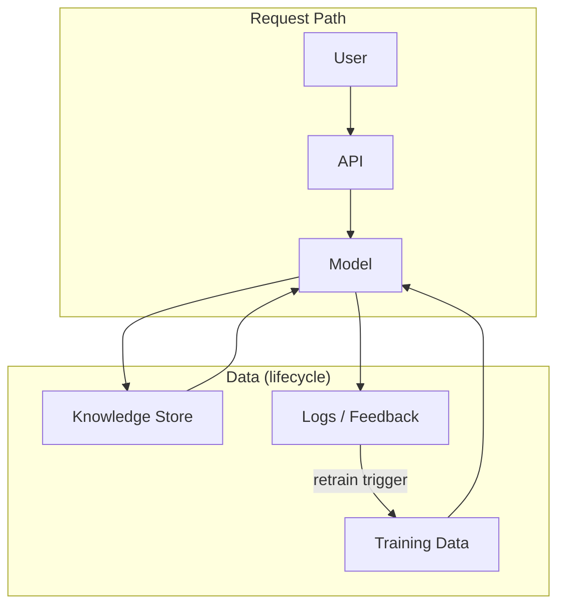

# Real-World AI Deployments

> "Technology is neither good nor bad; nor is it neutral."
> — Melvin Kranzberg (via Latour)

---
layout: default
---

# Conceptual Core

- Production differs from prototype: stakeholders, constraints, feedback
- Gap between lab and deployment: translation across worlds
- Stakeholders: users, operators, regulators, those affected indirectly

---
layout: default
---

# Conceptual Core (continued)

- Unintended consequences: bias amplification, data leakage, denial of opportunity
- Technology neither good nor bad nor neutral—choices have distributional effects
- Design for deployment from the start

---
layout: default
---

# Conceptual Core (continued)

- No "general" system—context-dependent intelligence

---
layout: default
---

# Technical Example

- Request path: user → API → model → response
- Data lifecycle: training data, knowledge store, logs, feedback
- Context shift: new products, languages, populations—model may degrade

---
layout: default
---

# Technical Example (continued)

- Request path and data lifecycle are coupled
- Audit: catalog API, model, knowledge store, logs

---
layout: default
---

# Philosophical Reflection

- Situated cognition: intelligence enacted in context
- No "general" system—domain, distribution, assumptions
- Training data, knowledge store, logs: conditions of "knowing"

---
layout: default
---

# Philosophical Reflection (continued)

- Who produces, curates, decides? Epistemic and political
- Observability shapes governability
.Figure 2.1: Production AI pipeline — data lifecycle (training, knowledge, logs)
[plantuml,ch02-l01,png,theme=sketchy-outline]
....
@startuml
|Request Path|
start
:User;
:API;
:Model;
|Data (lifecycle)|
:Training Data;
:Knowledge Store;
:Logs / Feedback;
stop
@enduml
....

---
layout: default
---

# Discussion Prompts

- Can you think of an AI system that worked in one context but failed in another?
- Who are the stakeholders for a system you use? Who might be affected without using it?
- What would "design for deployment" mean for your student-ai/ project?

---
layout: default
---

# Discussion Prompts (continued)

- Is the myth of the "general" system still influential? Where do you see it?

---
layout: default
---

# Diagram

---
layout: default
---

# Lab Prep

- Lab 1: Inventory and Dependencies—catalog a deployed AI system
- List: data sources, models, APIs, knowledge stores, logs
- Map dependencies: what depends on what?

---
layout: default
---

# Lab Prep (continued)

- Foundation for audit tool (Labs 2–3)

---
layout: center
---

# Questions?
