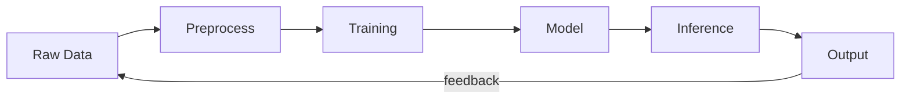

# Data Pipelines and Knowledge Flow

> "Knowledge is not something that is possessed but something that is done."
> — John Dewey (via ANT)

---
layout: default
---

# Conceptual Core

- Data pipelines: ingestion, transformation, storage, serving
- Training data → model → inference → (feedback) → training data
- Data does not flow by itself—actors move, transform, contest

---
layout: default
---

# Conceptual Core (continued)

- Feedback loop: outputs become training signals
- Who produces? Who consumes? Who governs?
- Pipelines as infrastructure—invisible until they fail

---
layout: default
---

# Technical Example

- Minimal pipeline: raw → preprocess → train → model → serve
- Failure points at each stage
- Feedback can amplify bias—rich get richer

---
layout: default
---

# Technical Example (continued)

- Map: source → transform → output → (feedback?)
- Trace a single datum through the pipeline

---
layout: default
---

# Philosophical Reflection

- Data as trace of practice—exclusions matter
- Epistemic circulation: what counts as data, signal, noise
- Knowledge produced through pipeline operation

---
layout: default
---

# Philosophical Reflection (continued)

- Audit the pipeline: sources, transformations, flow
- Treat pipelines as knowledge-producing machinery
.Figure 2.2: Data pipeline with feedback loop
[plantuml,ch02-l02,png,theme=sketchy-outline]
....
@startuml
start
:Raw Data;
:Preprocess;
:Training;
:Model;
:Inference;
:Output;
note right: feedback
stop
@enduml
....

---
layout: default
---

# Discussion Prompts

- Can you trace where the training data for a system you use came from?
- When have you seen feedback loops amplify bias or preference?
- What would be excluded from a pipeline you know? Why might that matter?

---
layout: default
---

# Discussion Prompts (continued)

- How does "knowledge as doing" change how you think about data?

---
layout: default
---

# Diagram

---
layout: default
---

# Lab Prep

- Map data flow: sources → preprocess → model → output
- Identify feedback loops
- Diagram or narrative—inform Lab 2 traceability

---
layout: default
---

# Lab Prep (continued)

- Log what flows where for accountability

---
layout: center
---

# Questions?
