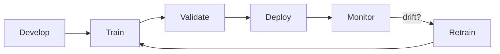

# Model Lifecycle — Training, Deployment, Drift

> "Stability is not the absence of change but the capacity to change."
> — Deleuze (adapted)

---
layout: default
---

# Conceptual Core

- Model lifecycle: develop, train, validate, deploy, monitor, retrain
- Concept drift: input-output relationship changes
- Data drift: input distribution changes

---
layout: default
---

# Conceptual Core (continued)

- Retraining triggers: scheduled, metric-based, event-based
- Versioning: which model produced which decision
- CI/CD for models: pipelines, validation, deployment

---
layout: default
---

# Conceptual Core (continued)

- Stability as capacity to change

---
layout: default
---

# Technical Example

- Drift detection: baseline vs. current distribution
- Retraining workflow: data → preprocess → train → validate → deploy
- CI/CD for models: model as artifact

---
layout: default
---

# Technical Example (continued)

- Trace schema: log model version with each decision
- Lab 2: Traceability—implement trace schema

---
layout: default
---

# Philosophical Reflection

- Models: snapshots of a moving world
- Tension: stability vs. adaptation
- Deployment as ongoing process, not one-time event

---
layout: default
---

# Philosophical Reflection (continued)

- Audit: surface lifecycle—version, training date, retrain trigger
.Figure 2.3: Model lifecycle (training → deploy → monitor → retrain)
[plantuml,ch02-l03,png,theme=sketchy-outline]
....
@startuml
start
:Develop;
:Train;
:Validate;
:Deploy;
:Monitor;
:Retrain;
note right: drift?
stop
@enduml
....

---
layout: default
---

# Discussion Prompts

- Have you experienced "model decay" in a system you use? How did you notice?
- How would you choose retraining triggers: scheduled, metric-based, or event-based?
- What does "stability as capacity to change" mean for AI governance?

---
layout: default
---

# Discussion Prompts (continued)

- Why is versioning essential for accountability?

---
layout: default
---

# Diagram

---
layout: default
---

# Lab Prep

- Log model version with each decision
- Trace: request ID, timestamp, model version, input/output summary
- Enables audit: trace bad decision to exact model

---
layout: default
---

# Lab Prep (continued)

- Consider: data version, config version

---
layout: center
---

# Questions?
