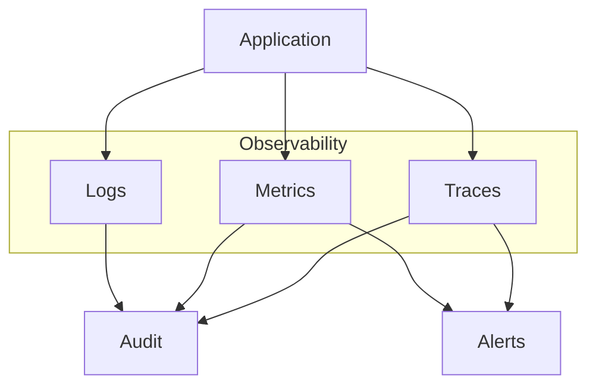

# Observability and Accountability

> "Visibility is a trap."
> — Michel Foucault

---
layout: default
---

# Conceptual Core

- Observability: logs, metrics, traces
- What we log shapes what we see; what we see shapes what we govern
- Foucault: visibility as trap—observability enables control

---
layout: default
---

# Conceptual Core (continued)

- Log: inputs, outputs, model version, latency, errors
- Metrics: request rate, latency, error rate
- Traces: request ID across services

---
layout: default
---

# Conceptual Core (continued)

- Observability is precondition for audit and accountability

---
layout: default
---

# Technical Example

- Structured logging: request_id, timestamp, model_version, input/output hash, latency
- Correlation IDs across services
- Trace: request → API → model → retrieval → response

---
layout: default
---

# Technical Example (continued)

- Observability stack: logs, metrics, traces → audit, alerts
- Lab 2: Implement trace schema for audit tool

---
layout: default
---

# Philosophical Reflection

- Panopticon: visibility enables control, self-discipline
- Observability as governance—we govern what we see
- Design of observability = design of governance

---
layout: default
---

# Philosophical Reflection (continued)

- Logs provide evidence; assignment requires policy
- Audit tool: governance infrastructure
.Figure 2.4: Observability stack (logs, metrics, traces, alerts)
[plantuml,ch02-l04,png,theme=sketchy-outline]
....
@startuml
|Observability|
start
:Application;
fork
  :Logs;
fork again
  :Metrics;
fork again
  :Traces;
end fork
:Audit;
:Alerts;
stop
@enduml
....

---
layout: default
---

# Discussion Prompts

- When has observability (or its absence) mattered in a system you used?
- What should *not* be logged? Privacy, security, abuse potential?
- Does "visibility is a trap" apply to AI systems? How?

---
layout: default
---

# Discussion Prompts (continued)

- Who should have access to audit trails?

---
layout: default
---

# Diagram

---
layout: default
---

# Lab Prep

- Define trace schema: fields for each request
- Support: end-to-end trace, model version, input/output summary
- Schema feeds Lab 3 report generation

---
layout: center
---

# Questions?
