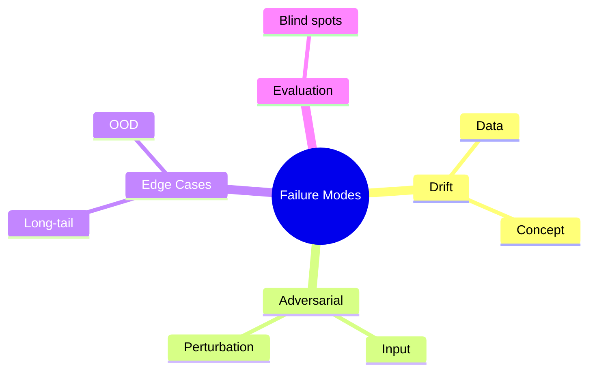

# Failure Modes and Brittleness

> "The map is not the territory."
> — Korzybski

---
layout: default
---

# Conceptual Core

- Adversarial examples: small perturbation → large output change
- Distribution shift, OOD: inputs from different distribution
- Edge cases, long-tail: rare inputs, model fails

---
layout: default
---

# Conceptual Core (continued)

- Evaluation blind spots: metrics miss important failures
- Brittleness: specialization trades robustness for performance
- Failure as epistemic signal—reveals model's limits

---
layout: default
---

# Conceptual Core (continued)

- Document failure modes for responsible deployment

---
layout: default
---

# Technical Example

- Stress-test: OOD, adversarial, edge cases
- Document: what fails, how
- Taxonomy: Drift, Adversarial, Edge Cases, Evaluation

---
layout: default
---

# Technical Example (continued)

- Classify failures to inform remediation
- Lab 2: Include failure mode analysis in trace design

---
layout: default
---

# Philosophical Reflection

- Map ≠ territory—limits of representation
- Silent failure: confident wrong answer
- Failure may reveal framing limits

---
layout: default
---

# Philosophical Reflection (continued)

- Documenting failure = epistemic humility
- Audit surfaces boundaries: "may fail when..."
.Figure 2.5: Failure mode taxonomy (incl. evaluation blind spots)
[mermaid,ch02-l05,png]
....
mindmap
  root((Failure Modes))
    Drift
      Data
      Concept
    Adversarial
      Input
      Perturbation
    Edge Cases
      Long-tail
      OOD
    Evaluation
      Blind spots
....

---
layout: default
---

# Discussion Prompts

- Have you encountered "silent" failure—a system that failed confidently?
- When does a failure indicate a model problem vs. a framing problem?
- How would you stress-test your student-ai/ system?

---
layout: default
---

# Discussion Prompts (continued)

- What failure modes should an audit report disclose to users?

---
layout: default
---

# Diagram

---
layout: default
---

# Lab Prep

- Add failure mode classification to trace
- failure_mode: drift | adversarial | edge_case | evaluation
- Audit report surfaces failure modes and mitigations

---
layout: center
---

# Questions?
