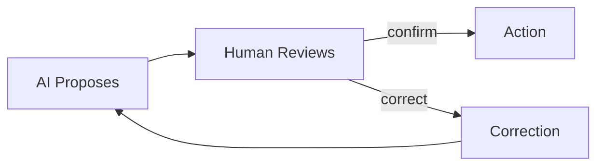

# Human-AI Collaboration

> "The human is not the center; the human is a node in the network."
> — Bruno Latour

---
layout: default
---

# Conceptual Core

- Human-in-the-loop: AI proposes, human reviews
- When: high stakes, uncertainty, human judgment needed
- Delegation vs. augmentation vs. partnership—different accountability

---
layout: default
---

# Conceptual Core (continued)

- Calibration: over-trust vs. under-trust
- Feedback: overrides and corrections as training signal
- Distributed cognition: decision lives in the collective

---
layout: default
---

# Technical Example

- Handoff: AI proposes → human confirms/corrects
- Corrections as training signal
- Document handoff points: where, what info, what authority

---
layout: default
---

# Technical Example (continued)

- Lab 3: Audit report surfaces human-AI interaction points
- Meaningful agency: info, time, authority

---
layout: default
---

# Philosophical Reflection

- Distributed cognition: decision emerges from interaction
- Agency in hybrid systems: distributed, not centralized
- "Human responsible" requires capacity for meaningful review

---
layout: default
---

# Philosophical Reflection (continued)

- Design: accessible reasoning, scoped task, documented handoff
.Figure 2.6: Human-AI collaboration loop
[plantuml,ch02-l06,png,theme=sketchy-outline]
....
@startuml
start
:AI Proposes;
:Human Reviews;
:Action;
:Correction;
stop
@enduml
....

---
layout: default
---

# Discussion Prompts

- When have you over-trusted or under-trusted an AI system?
- What would "meaningful" human review require in a domain you know?
- Where does "the decision" live in a human-AI system you use?

---
layout: default
---

# Discussion Prompts (continued)

- Can accountability be distributed, or must there be a single responsible party?

---
layout: default
---

# Diagram

---
layout: default
---

# Lab Prep

- Lab 3: Report surfaces human-AI interaction points
- Per component: human in loop? stage? what they see? what they can do?
- Assess: meaningful or performative agency

---
layout: center
---

# Questions?
