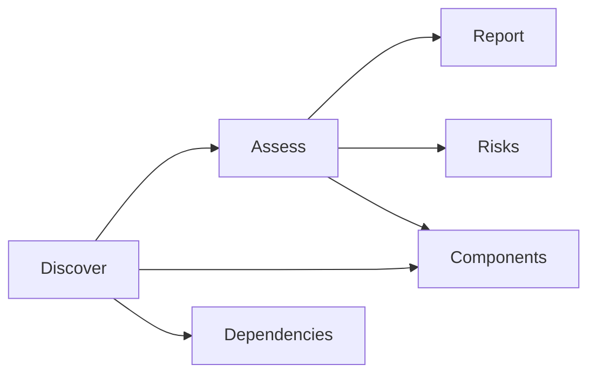

# AI System Audits

> "To govern is to structure the possible field of action."
> — Michel Foucault

---
layout: default
---

# Conceptual Core

- Audit: assess components, risks, compliance
- Audit constitutes what counts as well-governed
- Frameworks: bias, safety, transparency, performance

---
layout: default
---

# Conceptual Core (continued)

- Audit as governance practice
- Audit tool: discover, assess, report
- Tool server in student-ai/—reusable, scalable

---
layout: default
---

# Technical Example

- Report schema: components, risks, recommendations
- Component discovery: configs, API calls, manifests
- Pipeline: Discover → Assess → Report

---
layout: default
---

# Technical Example (continued)

- Lab 3: Implement full audit pipeline
- Traces feed report

---
layout: default
---

# Philosophical Reflection

- Audits as disciplinary technology—shape behavior
- Who audits the auditors? Reflexivity
- Audit tool: agent invokes for self-inspection

---
layout: default
---

# Philosophical Reflection (continued)

- Metacognition as infrastructure
.Figure 2.7: Audit tool pipeline (discover → assess → report)
[plantuml,ch02-l07,png,theme=sketchy-outline]
....
@startuml
start
:Discover;
:Assess;
:Report;
:Components;
:Dependencies;
:Risks;
stop
@enduml
....

---
layout: default
---

# Discussion Prompts

- What would an audit miss if it only looked at accuracy?
- How do audits shape what organizations optimize for?
- Should the agent be able to audit itself? What are the limits?

---
layout: default
---

# Discussion Prompts (continued)

- Who should have access to audit reports?

---
layout: default
---

# Diagram

---
layout: default
---

# Lab Prep

- Lab 3: Full audit pipeline—discover, assess, report
- Use inventory (Lab 1), trace schema (Lab 2)
- Report: components, dependencies, risks, recommendations

---
layout: default
---

# Lab Prep (continued)

- Integrate as tool server (Lecture 2.8)

---
layout: center
---

# Questions?
