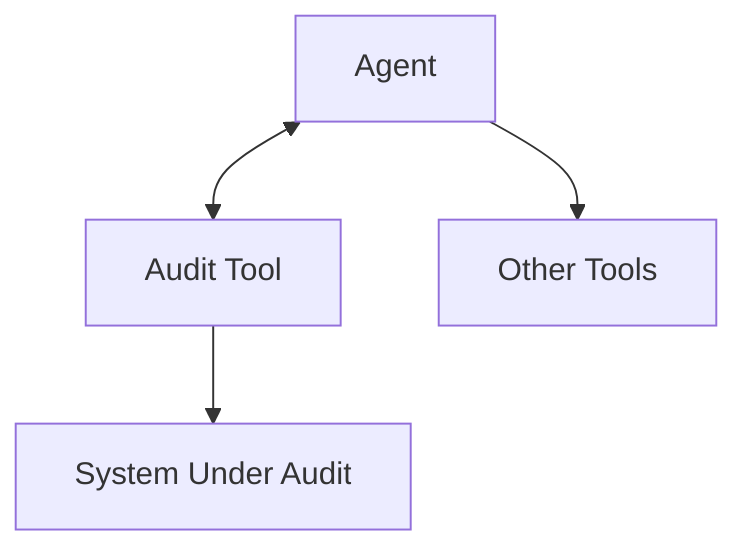

# Lab Integration — Audit Tool and Capstone

> "The tool extends the body; the audit extends the gaze."
> — Latour (adapted)

---
layout: default
---

# Conceptual Core

- Integrate audit tool as tool server `audit`
- Tools: list_components, trace_request, generate_report
- Agent invokes for self-inspection

---
layout: default
---

# Conceptual Core (continued)

- Before task: check health; after change: verify; on request: report
- Audit extends gaze—agent sees dependencies, traces, state
- Connection to Ch11: internal governance

---
layout: default
---

# Conceptual Core (continued)

- Reflexivity: AI that can audit itself

---
layout: default
---

# Technical Example

- Register audit in agent tool config
- Invocation: start of session, on demand, when errors spike
- Agent = auditor and auditee

---
layout: default
---

# Technical Example (continued)

- Metacognition as infrastructure

---
layout: default
---

# Philosophical Reflection

- Reflexivity: observe the observer
- Metacognition: thinking about thinking
- Audit tool = infrastructure for self-observation

---
layout: default
---

# Philosophical Reflection (continued)

- Extended gaze supports governance
- Capstone: agent with self-inspection capacity
.Figure 2.8: Audit tool in agent stack (incl. self-inspection)
[plantuml,ch02-l08,png,theme=sketchy-outline]
....
@startuml
start
:Agent;
:Audit Tool;
:System Under Audit;
:Other Tools;
stop
@enduml
....

---
layout: default
---

# Discussion Prompts

- What would the agent need to do with audit results to be "self-governing"?
- When should an agent self-audit—proactively or only on demand?
- Is "metacognition as infrastructure" a form of governance or surveillance?

---
layout: default
---

# Discussion Prompts (continued)

- How does the audit tool change your relationship to the agent you build?

---
layout: default
---

# Diagram

---
layout: default
---

# Lab Prep

- Complete Labs 1–3, submit audit tool
- Integrate as submodule in student-ai/
- Test: agent invokes audit tools

---
layout: default
---

# Lab Prep (continued)

- Document API and invocation pattern

---
layout: center
---

# Questions?
