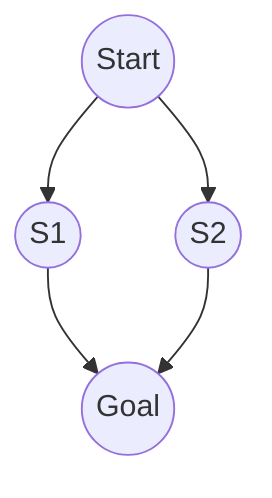

# Problem Spaces and State Representation

> "Every representation is a reduction."
> — Jacques Derrida

---
layout: default
---

# Conceptual Core

- State space: states, initial state, goal, actions
- Successor function: state + action → next state
- Problem space = graph; search = traversal

---
layout: default
---

# Conceptual Core (continued)

- Representation is reduction—what we include/omit matters
- Completeness: finds solution if exists
- Optimality: finds best solution

---
layout: default
---

# Conceptual Core (continued)

- Representation choice is epistemic

---
layout: default
---

# Technical Example

- 8-puzzle: state = tile positions; actions = move empty
- Navigation: state = (x,y); actions = N/S/E/W
- State equality and successor generation—implement once, reuse algorithms

---
layout: default
---

# Technical Example (continued)

- Lab 1: Formalize 2–3 domains as state spaces

---
layout: default
---

# Philosophical Reflection

- Abstraction: what matters, what we exclude
- Wrong abstraction → solution fails in practice
- Representation is the first act of search
.Figure 3.1: State space for sample problem
[plantuml,ch03-l01,png,theme=sketchy-outline]
....
@startuml
start
:Start;
fork
  :S1;
  :Goal;
fork again
  :S2;
  :Goal;
end fork
stop
@enduml
....

---
layout: default
---

# Discussion Prompts

- What would be lost if we represented a "real" problem (e.g., career planning) as a state space?
- When is a minimal representation sufficient? When is it dangerous?
- Who decides what goes in the state? What are the stakes?

---
layout: default
---

# Diagram

---
layout: default
---

# Lab Prep

- Lab 1: Formalize 2–3 domains
- Define: states, initial, goal, actions, successor
- Implement equality and successor generation

---
layout: center
---

# Questions?
