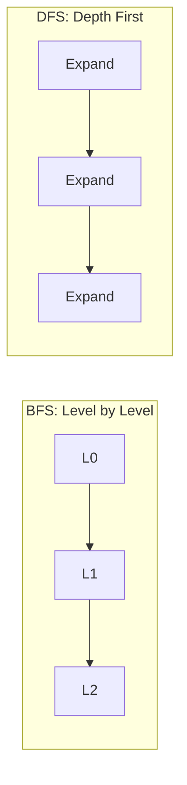

# Uninformed Search — BFS, DFS, Iterative Deepening

> "Strategy without tactics is the slowest route to victory."
> — Sun Tzu (via search algorithms)

---
layout: default
---

# Conceptual Core

- BFS: shallowest first, queue, complete, optimal for unit cost, high memory
- DFS: deepest first, stack, space-efficient, may not terminate, not optimal
- Iterative deepening: DFS with increasing depth limit—complete, optimal, low memory

---
layout: default
---

# Conceptual Core (continued)

- Frontier and explored set—avoid re-expansion
- When sufficient: bounded space, no heuristic, need completeness

---
layout: default
---

# Technical Example

- BFS: queue, mark visited
- DFS: stack, mark visited
- Compare: time, space, path length

---
layout: default
---

# Technical Example (continued)

- Iterative deepening: DFS with depth limit, increment
- Lab 2: Implement BFS, DFS in search engine

---
layout: default
---

# Philosophical Reflection

- Exhaustive search: epistemic humility—we don't assume we know
- Large spaces: uninformed search intractable
- Choice: restrict space or add heuristics
.Figure 3.2: BFS vs DFS frontier expansion
[plantuml,ch03-l02,png,theme=sketchy-outline]
....
@startuml
start
:"BFS: Level by Level";
:L0;
:L1;
:L2;
:"DFS: Depth First";
:Expand;
stop
@enduml
....

---
layout: default
---

# Discussion Prompts

- When would you choose BFS over DFS, or vice versa?
- Is "blind" search ever preferable to "guided" search?
- What does "epistemic humility" mean for algorithm design?

---
layout: default
---

# Diagram

---
layout: default
---

# Lab Prep

- Lab 2: Implement BFS, DFS
- Generic graph interface
- Benchmark: nodes expanded, memory, solution length

---
layout: center
---

# Questions?
