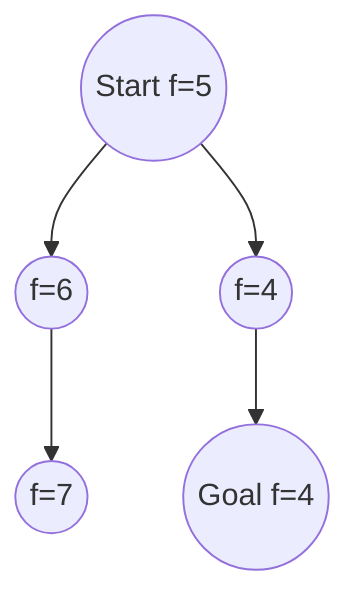

# Informed Search — A* and Heuristics

> "The heuristic is a bet on the structure of the world."
> — (adapted)

---
layout: default
---

# Conceptual Core

- Heuristic h(n): estimate of cost to goal
- Greedy best-first: expand lowest h(n)—fast, not optimal
- A*: f(n) = g(n) + h(n); expand lowest f(n)

---
layout: default
---

# Conceptual Core (continued)

- Admissible: h never overestimates; consistent: triangle inequality
- A* with admissible+consistent: complete and optimal
- Designing heuristics: relaxed problems, pattern databases

---
layout: default
---

# Conceptual Core (continued)

- Wrong heuristic: wasted effort or suboptimal

---
layout: default
---

# Technical Example

- A* with Manhattan distance (admissible)
- Inadmissible: may be faster, risks suboptimality
- Lab 2: Implement A* with admissible heuristic

---
layout: default
---

# Technical Example (continued)

- Search engine: TF-IDF as relevance heuristic

---
layout: default
---

# Philosophical Reflection

- Heuristics = prior knowledge
- Wrong prior: overestimate → miss optimal; underestimate → no guidance
- Calibrate: informative but admissible
.Figure 3.3: A* expansion with f-values
[plantuml,ch03-l03,png,theme=sketchy-outline]
....
@startuml
start
:Start f=5;
fork
  :f=6;
  :f=7;
fork again
  :f=4;
  :Goal f=4;
end fork
stop
@enduml
....

---
layout: default
---

# Discussion Prompts

- When is an inadmissible heuristic acceptable?
- How do you design a heuristic for a domain you know?
- What does "bet on structure" mean for real-world search?

---
layout: default
---

# Diagram

---
layout: default
---

# Lab Prep

- Lab 2: A* with admissible heuristic
- Pathfinding: Manhattan/Euclidean
- Puzzles: relaxed-problem heuristics

---
layout: default
---

# Lab Prep (continued)

- Verify optimality

---
layout: center
---

# Questions?
