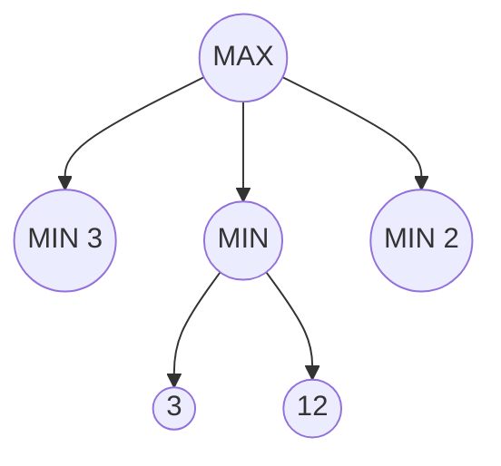

# Adversarial Search — Game Trees

> "Play is the highest form of research."
> — Einstein (games as search)

---
layout: default
---

# Conceptual Core

- Minimax: MAX maximizes, MIN minimizes
- Recursive: terminal = utility; MAX = max(successors); MIN = min(successors)
- Alpha-beta: prune when alpha >= beta

---
layout: default
---

# Conceptual Core (continued)

- Evaluation function: heuristic for non-terminal states
- Limited depth: horizon effect
- Assumes rational opposition

---
layout: default
---

# Technical Example

- Tic-tac-toe: full minimax, add alpha-beta
- Measure pruning efficiency
- Limited depth + evaluation for larger games

---
layout: default
---

# Technical Example (continued)

- Lab 2: Optional adversarial extension

---
layout: default
---

# Philosophical Reflection

- Minimax assumes rational opponent—baseline
- Fallible opponents: richer modeling
- Evaluation functions encode human judgment
.Figure 3.4: Minimax tree with alpha-beta cutoffs
[plantuml,ch03-l04,png,theme=sketchy-outline]
....
@startuml
start
:MAX;
fork
  :MIN 3;
fork again
  :MIN;
  fork
    :3;
  fork again
    :12;
  end fork
fork again
  :MIN 2;
end fork
stop
@enduml
....

---
layout: default
---

# Discussion Prompts

- When does the "rational opponent" assumption fail?
- How would you design an evaluation function for a game you know?
- Is adversarial search a good model for real-world competition?

---
layout: default
---

# Diagram

---
layout: default
---

# Lab Prep

- Optional: minimax + alpha-beta for simple game
- Deepens state-space understanding
- Main deliverable: retrieval, ranking

---
layout: center
---

# Questions?
