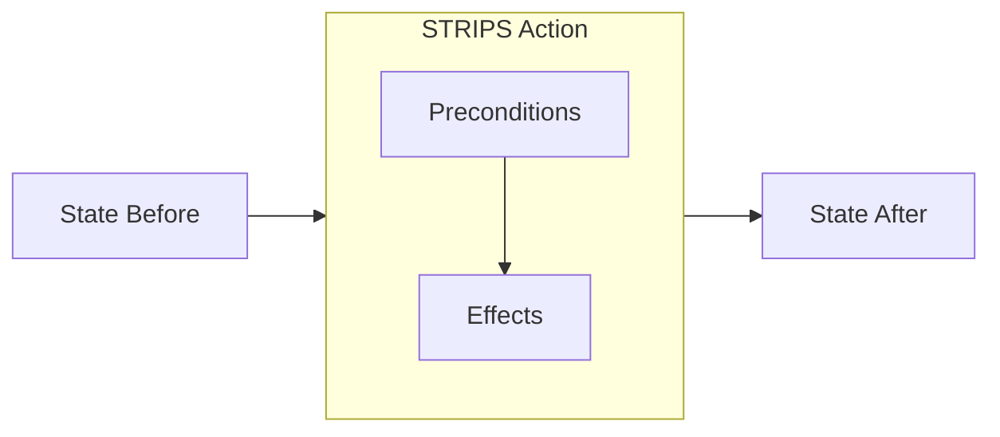

# Planning as Search — STRIPS, PDDL

> "Plans are worthless, but planning is everything."
> — Eisenhower

---
layout: default
---

# Conceptual Core

- STRIPS: states (facts), actions (preconditions, effects)
- Forward planning: initial → apply actions → goal
- Backward planning: goal → reverse actions → initial

---
layout: default
---

# Conceptual Core (continued)

- Plan-space search: refine partial plans
- PDDL: domain + problem files
- Frame problem: what stays the same? Frame axiom: only explicit changes

---
layout: default
---

# Conceptual Core (continued)

- Planners: FF, Fast Downward

---
layout: default
---

# Technical Example

- PDDL: blocks world, logistics, etc.
- Planners search implicit graph
- Lab 3: Search engine supports planning queries (index → search → plan)

---
layout: default
---

# Technical Example (continued)

- Successor = action application

---
layout: default
---

# Philosophical Reflection

- Frame problem: indirect effects
- Classical planning: frame axiom, limited scope
- Planning process clarifies goals and options
.Figure 3.5: STRIPS action representation
[plantuml,ch03-l05,png,theme=sketchy-outline]
....
@startuml
start
:"STRIPS Action";
:Preconditions;
:Effects;
:State Before;
:State After;
stop
@enduml
....

---
layout: default
---

# Discussion Prompts

- When does the frame axiom fail in real domains?
- What would planning for your knowledge graph explorer look like?
- Is "planning is everything" true for AI systems?

---
layout: default
---

# Diagram

---
layout: default
---

# Lab Prep

- Lab 3: Indexing and retrieval
- Planning: index actions/states, search for plans
- Core: document index, query, rank

---
layout: center
---

# Questions?
