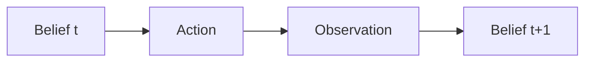

# Partial Observability and Belief States

> "Ignorance is not simply the absence of knowledge."
> — Epistemology (via POMDPs)

---
layout: default
---

# Conceptual Core

- Fully vs. partially observable
- Belief state: set or distribution over states
- POMDP: states, actions, observations, transition, observation model

---
layout: default
---

# Conceptual Core (continued)

- Belief update: Bayes' rule
- Sensor models: observations depend on state
- Cost: belief space large, intractable

---
layout: default
---

# Conceptual Core (continued)

- Approximation: particles, point-based, heuristics

---
layout: default
---

# Technical Example

- Navigation with noisy sensors
- Belief update: prior, action, observation → posterior
- Discrete POMDP: small state space

---
layout: default
---

# Technical Example (continued)

- Uncertain queries: ambiguous intent, distribution over results

---
layout: default
---

# Philosophical Reflection

- Epistemic uncertainty: we don't know the state
- Belief encodes what we know
- Cost: reasoning over beliefs, space explodes

---
layout: default
---

# Philosophical Reflection (continued)

- Assume full observability at your peril
.Figure 3.6: Belief state evolution
[plantuml,ch03-l06,png,theme=sketchy-outline]
....
@startuml
start
:Belief t;
:Action;
:Observation;
:Belief t+1;
stop
@enduml
....

---
layout: default
---

# Discussion Prompts

- When does partial observability matter in systems you use?
- How would you approximate belief-state search for a real problem?
- What is "lost" when we assume full observability?

---
layout: default
---

# Diagram

---
layout: default
---

# Lab Prep

- Lab 3: Handle uncertain queries
- Ambiguous intent, multiple interpretations
- Design API for uncertainty

---
layout: center
---

# Questions?
