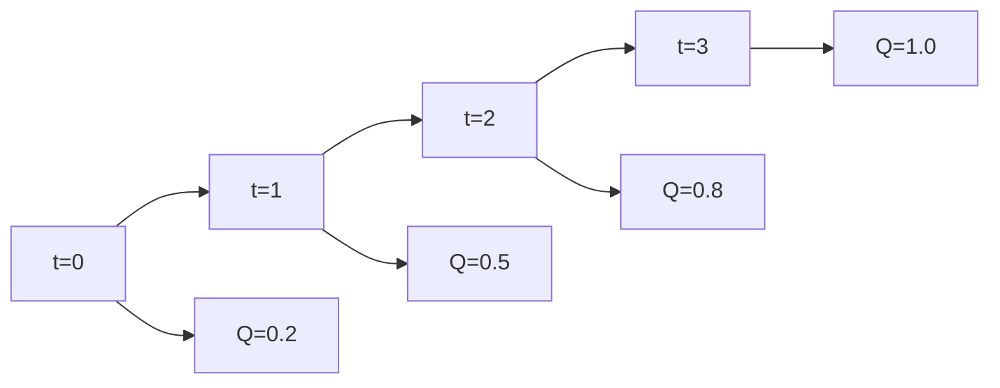

# Meta-Reasoning and Search Control

> "To think about thinking is to step outside—or is it?"
> — Recursion

---
layout: default
---

# Conceptual Core

- Meta-reasoning: how to search, not just what
- Anytime: return best-so-far, improve with time
- Real-time: act within time bound

---
layout: default
---

# Conceptual Core (continued)

- Resource-bounded: memory, time, energy
- Search control: expand, prune, restart, switch
- Bounded rationality: satisfice, heuristics

---
layout: default
---

# Technical Example

- Anytime A*: return improving solutions
- Quality vs. time tradeoff
- Lab 3: Configurable time/quality—max time, top-k early return

---
layout: default
---

# Technical Example (continued)

- Fast approximate vs. slow exact

---
layout: default
---

# Philosophical Reflection

- Bounded rationality: limited resources, satisfice
- Meta-reasoning: rules, learned policy, or more search
- Recursion can bottom out
.Figure 3.7: Anytime search (quality vs. time)
[plantuml,ch03-l07,png,theme=sketchy-outline]
....
@startuml
start
:t=0;
:t=1;
:t=2;
:t=3;
:Q=0.2;
:Q=0.5;
:Q=0.8;
:Q=1.0;
stop
@enduml
....

---
layout: default
---

# Discussion Prompts

- When would you choose fast approximate over slow exact?
- How do you "decide when to stop" in your own reasoning?
- Is meta-reasoning infinite regression, or can it bottom out?

---
layout: default
---

# Diagram

---
layout: default
---

# Lab Prep

- Lab 3: Time/quality tradeoffs
- Max time, top-k early, quality threshold
- Document for users

---
layout: center
---

# Questions?
