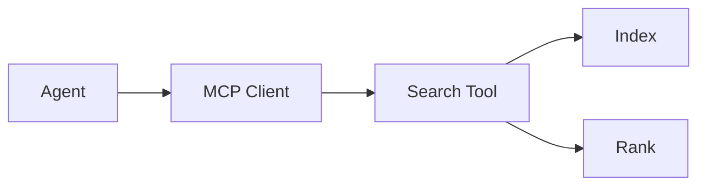

# Search in Agent Architectures

> "Search is not a module—it is a way of being in the world."
> — (adapted)

---
layout: default
---

# Conceptual Core

- Search as tool: agent invokes when needed
- student-ai/tools/search/: index, search, rank
- When: document retrieval, planning, graph traversal

---
layout: default
---

# Conceptual Core (continued)

- Inverted index + ranking: implicit "graph" of documents
- Search as delegated cognition
- Tool invocation: agent calls search tool

---
layout: default
---

# Technical Example

- API: index, query, rank
- Agent invokes via orchestrator
- Register in agent config

---
layout: default
---

# Technical Example (continued)

- Lab 1–3: Complete search engine, register, integrate

---
layout: default
---

# Philosophical Reflection

- Delegated cognition: agent uses tools to extend reach
- Agent + tools = hybrid collective
- Search = way of being in the world

---
layout: default
---

# Philosophical Reflection (continued)

- Tool extends agent's body
.Figure 3.8: Search tool in agent stack
[plantuml,ch03-l08,png,theme=sketchy-outline]
....
@startuml
start
:Agent;
:MCP Client;
:Search Tool;
:Index;
:Rank;
stop
@enduml
....

---
layout: default
---

# Discussion Prompts

- What does "search as a way of being" mean for the agent?
- How does tool delegation change the agent's "mind"?
- What other tools might extend the agent similarly?

---
layout: default
---

# Diagram

---
layout: default
---

# Lab Prep

- Complete Labs 1–3, submit search engine
- Register in student-ai/tools/search/
- Test: agent invokes search

---
layout: default
---

# Lab Prep (continued)

- Document API

---
layout: center
---

# Questions?
