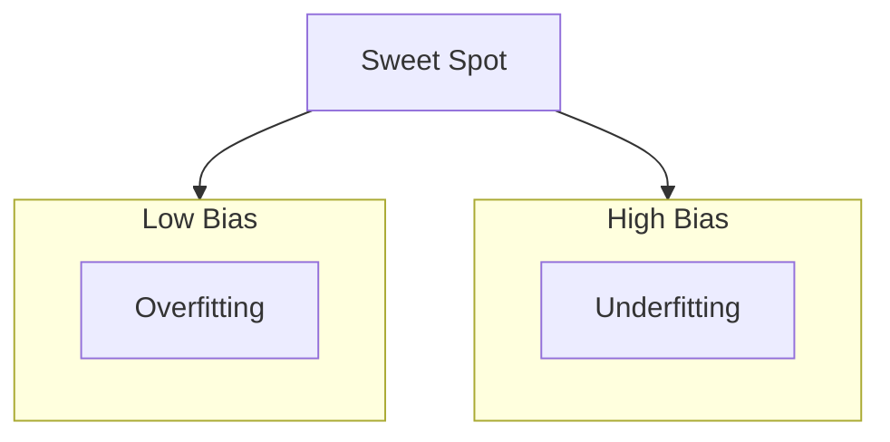

# Statistical Learning — Risk and Generalization

> "All models are wrong, but some are useful."
> — George Box

---
layout: default
---

# Conceptual Core

- Supervised learning: inputs, outputs, hypothesis space
- Risk: expected loss (training vs. generalization)
- Overfitting: memorize training, fail on new data

---
layout: default
---

# Conceptual Core (continued)

- Underfitting: too simple, high training loss
- Bias-variance tradeoff
- Learning = compression of experience

---
layout: default
---

# Conceptual Core (continued)

- All models wrong; some useful

---
layout: default
---

# Technical Example

- Linear model: train vs. validation loss
- Overfitting: validation rises while training falls
- Complexity: underfit ↔ overfit

---
layout: default
---

# Technical Example (continued)

- Lab 1: Data prep, features, train/val/test split

---
layout: default
---

# Philosophical Reflection

- Generalization = induction
- Hume: no proof future resembles past
- Assume same distribution for train and test

---
layout: default
---

# Philosophical Reflection (continued)

- "Learning" = minimize past loss, hope for future
.Figure 4.1: Bias-variance tradeoff
[plantuml,ch04-l01,png,theme=sketchy-outline]
....
@startuml
start
:"High Bias";
:Underfitting;
:"Low Bias";
:Overfitting;
:Sweet Spot;
stop
@enduml
....

---
layout: default
---

# Discussion Prompts

- When have you seen overfitting in practice?
- Is "all models are wrong" a pessimistic or liberating view?
- What does it mean to "learn" if we cannot prove generalization?

---
layout: default
---

# Diagram

---
layout: default
---

# Lab Prep

- Lab 1: Load data, features, train/val/test split
- Stratified for classification
- Pipeline: raw → preprocess → features → splits

---
layout: center
---

# Questions?
