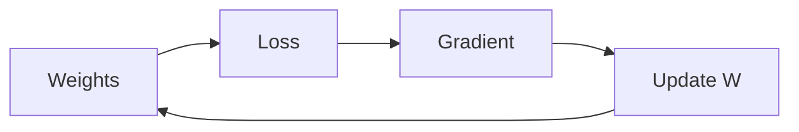

# Linear Models and Gradient Descent

> "The gradient points toward the steepest ascent—but the optimum may lie elsewhere."
> — Optimization (adapted)

---
layout: default
---

# Conceptual Core

- Linear regression, logistic regression
- Loss: MSE, cross-entropy
- Gradient descent: move opposite to gradient

---
layout: default
---

# Conceptual Core (continued)

- SGD, momentum, Adam
- Convex: one global min; non-convex: local minima
- Landscape determines success

---
layout: default
---

# Technical Example

- Implement: predict, loss, gradient, update
- Visualize convergence, loss surface
- Lab 2: Training loop for ml_trainer

---
layout: default
---

# Philosophical Reflection

- Local vs. global: gradient finds valley, maybe not lowest
- Optimization as metaphor
- Satisfice when we cannot optimize
.Figure 4.2: Gradient descent on loss surface
[plantuml,ch04-l02,png,theme=sketchy-outline]
....
@startuml
start
:Weights;
:Loss;
:Gradient;
:Update W;
stop
@enduml
....

---
layout: default
---

# Discussion Prompts

- When does gradient descent get stuck? How do we escape?
- Is "following the gradient" a good metaphor for learning?
- Why does Adam often work better than vanilla SGD?

---
layout: default
---

# Diagram

---
layout: default
---

# Lab Prep

- Lab 2: Training loop—model, loss, optimizer
- Log loss, save checkpoints

---
layout: center
---

# Questions?
