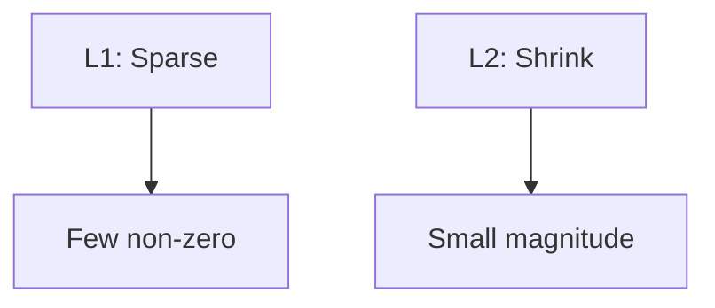

# Regularization and Model Selection

> "Simplicity is the ultimate sophistication."
> — Leonardo da Vinci (via Occam)

---
layout: default
---

# Conceptual Core

- L1 (Lasso): sparsity, feature selection
- L2 (Ridge): shrink weights
- Cross-validation: k-fold, average validation score

---
layout: default
---

# Conceptual Core (continued)

- Model selection: compare via CV
- Hyperparameter tuning
- Occam's razor: prefer simpler

---
layout: default
---

# Technical Example

- L1 vs L2: sparse vs. shrink
- k-fold CV for selection
- Lab 2: Add CV and regularization to ml_trainer

---
layout: default
---

# Philosophical Reflection

- Occam: prefer simpler
- Regularizer = prior
- Calibration: prior strength
.Figure 4.3: Regularization effect on coefficients
[plantuml,ch04-l03,png,theme=sketchy-outline]
....
@startuml
start
:L1: Sparse;
:Few non-zero;
:L2: Shrink;
:Small magnitude;
stop
@enduml
....

---
layout: default
---

# Discussion Prompts

- When is L1 better than L2? Vice versa?
- How many folds for cross-validation? Tradeoffs?
- Is "simplicity" always the right prior?

---
layout: default
---

# Diagram

---
layout: default
---

# Lab Prep

- Lab 2: CV + regularization
- L1, L2, k-fold
- Report best params and score

---
layout: center
---

# Questions?
