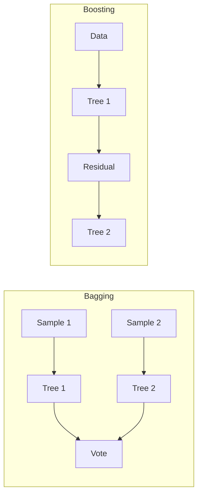

# Trees, Ensembles, and Boosting

> "The whole is greater than the sum of its parts."
> — Aristotle (via ensemble methods)

---
layout: default
---

# Conceptual Core

- Decision trees: splits, impurity, pruning
- Bagging: bootstrap samples, average/vote
- Random Forest: bagging + random features

---
layout: default
---

# Conceptual Core (continued)

- Boosting: sequential, focus on errors
- Stacking: meta-learner on base outputs
- Diversity + accuracy = strong ensemble

---
layout: default
---

# Technical Example

- Random Forest, XGBoost vs. single tree
- Lab 3: ml_trainer supports linear, tree, ensemble
- Modular: plug-in model classes

---
layout: default
---

# Philosophical Reflection

- Diversity: uncorrelated errors
- Aggregation works when individuals err differently
- Wisdom of crowds formalized
.Figure 4.4: Bagging vs. Boosting
[plantuml,ch04-l04,png,theme=sketchy-outline]
....
@startuml
start
:"Bagging";
:Sample 1;
:Tree 1;
:Sample 2;
:Tree 2;
:Vote;
:"Boosting";
:Data;
:Residual;
stop
@enduml
....

---
layout: default
---

# Discussion Prompts

- Why does Random Forest often beat a single tree?
- When might a single model beat an ensemble?
- What does "diversity" mean for human decision-making?

---
layout: default
---

# Diagram

---
layout: default
---

# Lab Prep

- Lab 3: Multiple model types
- Config-driven
- Linear, tree, Random Forest, gradient boosting

---
layout: center
---

# Questions?
