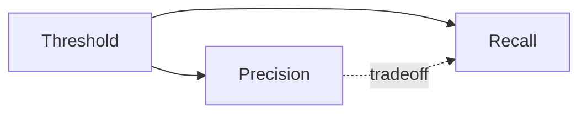

# Evaluation Metrics and Comparison

> "Not everything that counts can be counted."
> — William Bruce Cameron

---
layout: default
---

# Conceptual Core

- Accuracy: misleading when imbalanced
- Precision, recall, F1, ROC-AUC
- Imbalanced: precision/recall, stratification, class weights

---
layout: default
---

# Conceptual Core (continued)

- Regression: MSE, MAE, R²
- Model comparison: McNemar, bootstrap
- Metrics = value judgments

---
layout: default
---

# Technical Example

- Confusion matrix, precision, recall, F1
- McNemar for paired comparison
- Imbalanced: stratify, weights, threshold

---
layout: default
---

# Technical Example (continued)

- Lab 2–3: Evaluation, comparison in ml_trainer

---
layout: default
---

# Philosophical Reflection

- "Better" is not objective
- Metric choice = value choice
- Politics of metrics: what we measure, we manage
.Figure 4.5: Precision-recall tradeoff
[plantuml,ch04-l05,png,theme=sketchy-outline]
....
@startuml
start
:Threshold;
:Precision;
:Recall;
stop
@enduml
....

---
layout: default
---

# Discussion Prompts

- When is accuracy acceptable? When is it misleading?
- How would you choose between precision and recall?
- What cannot be captured by a single metric?

---
layout: default
---

# Diagram

---
layout: default
---

# Lab Prep

- Lab 2–3: Evaluation metrics
- Classification: accuracy, precision, recall, F1, AUC
- Regression: MSE, MAE, R²

---
layout: default
---

# Lab Prep (continued)

- Optional: statistical comparison

---
layout: center
---

# Questions?
