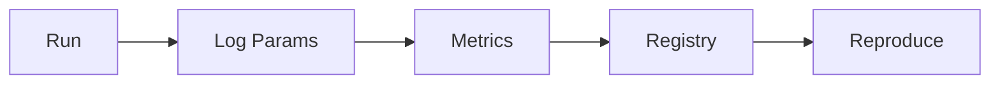

# Experiment Tracking and Reproducibility

> "Science is organized knowledge. Reproducibility is its organizing principle."
> — (adapted)

---
layout: default
---

# Conceptual Core

- Experiment tracking: params, metrics, artifacts
- Tools: MLflow, W&B, Neptune
- Reproducibility: config + data + code + env → same result

---
layout: default
---

# Conceptual Core (continued)

- Seeds, environment, versioning
- Model registry: store, version, promote
- Reproducibility = epistemic virtue

---
layout: default
---

# Technical Example

- MLflow: log params, metrics, artifacts
- Compare runs, reproduce from config
- Lab 3: Integrate tracking into ml_trainer

---
layout: default
---

# Philosophical Reflection

- Failed experiments matter
- Track all runs, not just successes
- Reproducibility has limits
.Figure 4.6: Experiment tracking pipeline
[plantuml,ch04-l06,png,theme=sketchy-outline]
....
@startuml
start
:Run;
:Log Params;
:Registry;
:Reproduce;
stop
@enduml
....

---
layout: default
---

# Discussion Prompts

- Why are "failed" experiments undervalued? Should they be logged?
- What makes an experiment "reproducible enough"?
- How does tracking change how you work?

---
layout: default
---

# Diagram

---
layout: default
---

# Lab Prep

- Lab 3: Experiment tracking in ml_trainer
- Log config, metrics, model
- Enable comparison, reproduction

---
layout: center
---

# Questions?
