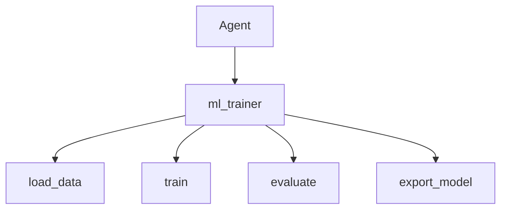

# ML in the Agent — The ml_trainer Tool

> "The tool does not determine the use—but it shapes the possible."
> — (adapted)

---
layout: default
---

# Conceptual Core

- ml_trainer tools: load_data, train, evaluate, export_model
- Agent invokes for custom adaptation
- Config-driven: YAML/JSON

---
layout: default
---

# Conceptual Core (continued)

- Delegation of learning to tool
- Agent can improve its components

---
layout: default
---

# Technical Example

- Schema: load_data, train, evaluate, export_model
- Config: model type, data, hyperparams
- Lab 3: Complete ml_trainer, register, test

---
layout: default
---

# Philosophical Reflection

- Agent invokes learning; does not update itself
- Fixed agent + adaptive models
- Learning as tool, not constitution
.Figure 4.7: ml_trainer in agent stack
[plantuml,ch04-l07,png,theme=sketchy-outline]
....
@startuml
start
:Agent;
:ml_trainer;
:load_data;
:train;
:evaluate;
:export_model;
stop
@enduml
....

---
layout: default
---

# Discussion Prompts

- When would the agent want to train a new model?
- What is the difference between "learning" and "invoking a trainer"?
- Should the agent be able to retrain its own components?

---
layout: default
---

# Diagram

---
layout: default
---

# Lab Prep

- Lab 3: Complete ml_trainer, register
- Test agent invocation
- First learning module—Ch5, Ch7 extend

---
layout: center
---

# Questions?
