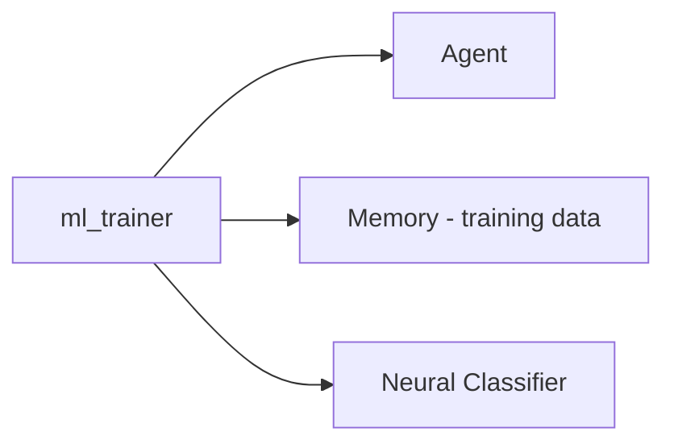

# Lab Integration — ML Model Trainer

> "Practice is the best of all instructors."
> — Publilius Syrus

---
layout: default
---

# Conceptual Core

- Recap: data prep, training, evaluation
- ml_trainer: load_data, train, evaluate, export
- student-ai/: adaptive components

---
layout: default
---

# Conceptual Core (continued)

- Ch5: neural classifiers; Ch7: memory for training data
- Tools adaptive, core fixed

---
layout: default
---

# Technical Example

- End-to-end: data → train → evaluate → use
- Submodule in student-ai/
- Pipeline: memory → ml_trainer → inference

---
layout: default
---

# Philosophical Reflection

- Agent uses models; does not become them
- Boundary: fixed core, adaptive tools
- Practice teaches
.Figure 4.8: ml_trainer and downstream consumers
[plantuml,ch04-l08,png,theme=sketchy-outline]
....
@startuml
start
:ml_trainer;
:Agent;
:Memory - training data;
:Neural Classifier;
stop
@enduml
....

---
layout: default
---

# Discussion Prompts

- Where is the boundary between "the agent" and "its tools"?
- How might ml_trainer connect to memory (Ch7)?
- Is "learning" the right word for "invoking a trainer"?

---
layout: default
---

# Diagram

---
layout: default
---

# Lab Prep

- Complete Labs 1–3, submit ml_trainer
- Integrate as submodule
- Document API, config

---
layout: default
---

# Lab Prep (continued)

- Ch5, Ch7 connections

---
layout: center
---

# Questions?
