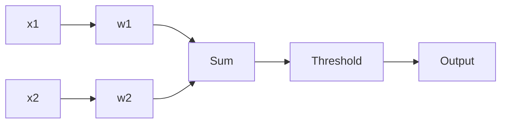

# Perceptrons and the Linear Boundary

> "The brain is a three-pound mass you can hold in your hand that can conceive of a universe."
> — (perceptron as first reduction)

---
layout: default
---

# Conceptual Core

- Perceptron: weighted sum + threshold, outputs 0 or 1
- Linear decision boundary
- Linear separability; XOR not linearly separable

---
layout: default
---

# Conceptual Core (continued)

- Perceptron learning rule: adjust weights on error
- Biological neuron → mathematical reduction

---
layout: default
---

# Technical Example

- Forward: weighted sum, step function
- Update: w += η * (target - output) * input
- Works for AND, OR; fails for XOR

---
layout: default
---

# Technical Example (continued)

- Lab 1: Single-layer baseline

---
layout: default
---

# Philosophical Reflection

- Perceptron as cartoon of neuron
- Limits of linearity
- Multiple layers overcome XOR
.Figure 5.1: Perceptron and decision boundary
[plantuml,ch05-l01,png,theme=sketchy-outline]
....
@startuml
start
:x1;
:w1;
:x2;
:w2;
:Sum;
:Threshold;
:Output;
stop
@enduml
....

---
layout: default
---

# Discussion Prompts

- What is lost when we reduce a neuron to a perceptron?
- Why does XOR matter? What does it represent?
- Is linear separability a natural or artificial constraint?

---
layout: default
---

# Diagram

---
layout: default
---

# Lab Prep

- Lab 1: Single-layer, forward pass
- Minimal case: perceptron
- Extends to multilayer

---
layout: center
---

# Questions?
