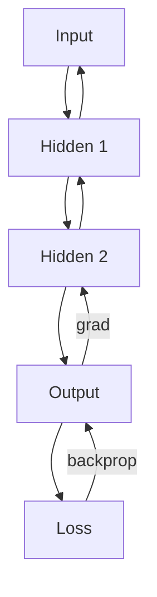

# Multilayer Networks and Backpropagation

> "Layers of representation: each level abstracts from the one below."
> — Deep learning (adapted)

---
layout: default
---

# Conceptual Core

- Feedforward: layers, activations
- ReLU, sigmoid, softmax
- Universal approximation (wide shallow net)

---
layout: default
---

# Conceptual Core (continued)

- Backpropagation: chain rule
- Credit assignment: which weights caused error?

---
layout: default
---

# Technical Example

- Forward: x → layers → output
- Backward: chain rule
- Numerical gradient check

---
layout: default
---

# Technical Example (continued)

- Lab 1: Full forward and backward

---
layout: default
---

# Philosophical Reflection

- Hidden layers: low-level → high-level features
- Opacity: useful but not interpretable
- Emergent from optimization
.Figure 5.2: Backpropagation flow
[plantuml,ch05-l02,png,theme=sketchy-outline]
....
@startuml
start
:Input;
:Hidden 1;
:Hidden 2;
:Output;
:Loss;
stop
@enduml
....

---
layout: default
---

# Discussion Prompts

- What would it mean to "understand" a hidden layer?
- Why does depth help if width can approximate?
- Is backprop a model of learning in the brain?

---
layout: default
---

# Diagram

---
layout: default
---

# Lab Prep

- Lab 1: Forward + backward, configurable
- Core of neural classifier

---
layout: center
---

# Questions?
