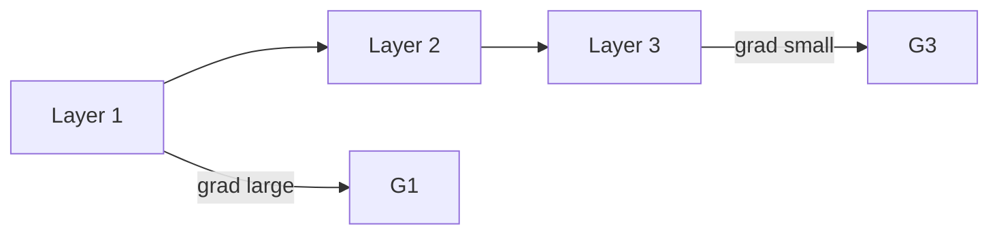

# Training Dynamics — Vanishing Gradients and Initialization

> "Every beginning is difficult."
> — Hegel (initialization matters)

---
layout: default
---

# Conceptual Core

- Vanishing: gradients shrink in deep sigmoid nets
- Exploding: weights grow, gradients diverge
- Xavier, He initialization

---
layout: default
---

# Conceptual Core (continued)

- Batch norm: normalize activations
- Residual connections: gradients flow through skip

---
layout: default
---

# Technical Example

- Visualize gradient flow
- Batch norm: faster, better
- Lab 2: Init + batch norm

---
layout: default
---

# Philosophical Reflection

- Fragility: small choices matter
- Theory vs. practice: engineering bridges gap
.Figure 5.3: Gradient flow (vanishing vs. healthy)
[plantuml,ch05-l03,png,theme=sketchy-outline]
....
@startuml
start
:Layer 1;
:Layer 2;
:Layer 3;
stop
@enduml
....

---
layout: default
---

# Discussion Prompts

- Why do biological brains not seem to have vanishing gradients?
- Is batch norm "cheating" or essential?
- What would a more robust optimization landscape look like?

---
layout: default
---

# Diagram

---
layout: default
---

# Lab Prep

- Lab 2: Init + batch norm
- Critical for deep nets

---
layout: center
---

# Questions?
