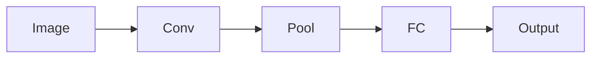

# Convolutional Networks — Structure and Translation

> "Translation invariance: the same pattern, anywhere."
> — CNNs

---
layout: default
---

# Conceptual Core

- Convolution: kernel, feature maps, padding, stride
- Pooling: max, average
- Conv blocks + FC head

---
layout: default
---

# Conceptual Core (continued)

- Inductive bias: local structure, translation equivariance

---
layout: default
---

# Technical Example

- LeNet-style: conv → pool → conv → pool → FC
- Visualize filters
- Lab 2: Conv layers in classifier

---
layout: default
---

# Philosophical Reflection

- Inductive bias reduces hypothesis space
- Convolution = prior
- Architecture = prior choice
.Figure 5.4: CNN architecture (conv → pool → fc)
[plantuml,ch05-l04,png,theme=sketchy-outline]
....
@startuml
start
:Image;
:Conv;
:Pool;
:FC;
:Output;
stop
@enduml
....

---
layout: default
---

# Discussion Prompts

- When is translation invariance wrong?
- What other inductive biases might we encode?
- Is convolution a "biological" prior?

---
layout: default
---

# Diagram

---
layout: default
---

# Lab Prep

- Lab 2: Conv support
- CNN for images, MLP for vectors
- Config-driven architecture

---
layout: center
---

# Questions?
