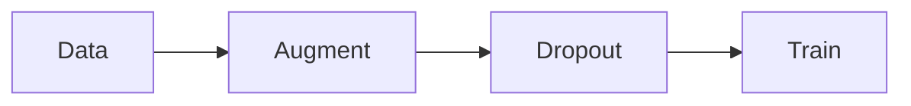

# Regularization — Dropout, Data Augmentation

> "Robustness through perturbation."
> — Regularization

---
layout: default
---

# Conceptual Core

- Dropout: random unit deletion, prevents co-adaptation
- Data augmentation: preserve semantics
- Early stopping

---
layout: default
---

# Conceptual Core (continued)

- L1/L2 on weights
- Structural + parametric regularization

---
layout: default
---

# Technical Example

- Dropout: 0.2–0.5 typical
- Augmentation: flip, crop, rotate
- Lab 2: Dropout + augmentation

---
layout: default
---

# Philosophical Reflection

- Perturbation → robustness
- Data vs. augmentation: blurry boundary
.Figure 5.5: Dropout and augmentation pipeline
[plantuml,ch05-l05,png,theme=sketchy-outline]
....
@startuml
start
:Data;
:Augment;
:Dropout;
:Train;
stop
@enduml
....

---
layout: default
---

# Discussion Prompts

- When does dropout hurt?
- How do you choose augmentation for a new domain?
- Is augmentation "cheating" or honest regularization?

---
layout: default
---

# Diagram

---
layout: default
---

# Lab Prep

- Lab 2: Dropout + augmentation
- Configurable per layer, per pipeline

---
layout: center
---

# Questions?
