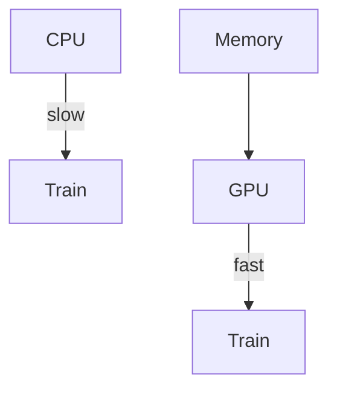

# GPU Acceleration — Training at Scale

> "Speed is a form of power."
> — Latour (adapted)

---
layout: default
---

# Conceptual Core

- GPUs: parallel matrix ops
- PyTorch/JAX: tensors on GPU
- Batch size: memory vs. throughput

---
layout: default
---

# Conceptual Core (continued)

- Profiling: CPU vs. GPU vs. memory
- Compute as infrastructure

---
layout: default
---

# Technical Example

- CPU vs. GPU: same code, .to(device)
- OOM: reduce batch, model
- Lab 2–3: GPU support

---
layout: default
---

# Philosophical Reflection

- Compute: who has access?
- Politics of scale
- Speed = power
.Figure 5.6: Training pipeline (CPU/GPU, memory)
[plantuml,ch05-l06,png,theme=sketchy-outline]
....
@startuml
start
:CPU;
:Train;
:GPU;
:Memory;
stop
@enduml
....

---
layout: default
---

# Discussion Prompts

- How does GPU access shape who can do ML research?
- What are the environmental costs of scale?
- Is "faster" always better?

---
layout: default
---

# Diagram

---
layout: default
---

# Lab Prep

- Lab 2–3: GPU support
- Config: device
- Document requirements

---
layout: center
---

# Questions?
