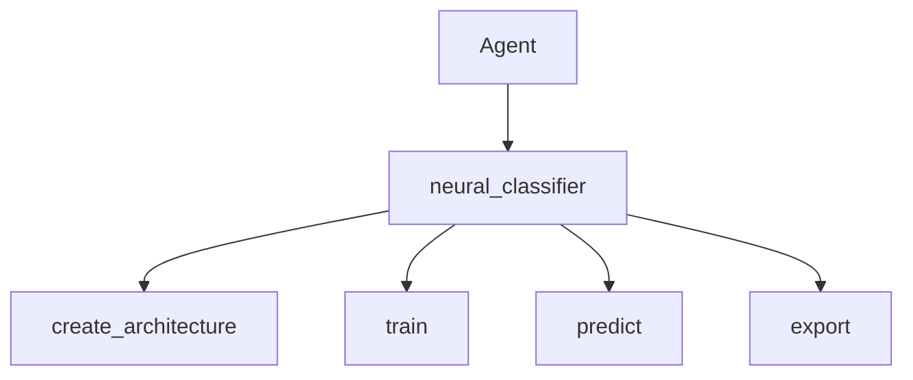

# Neural Classifier as Tool

> "The classifier is a tool—the agent decides when to use it."
> — (adapted)

---
layout: default
---

# Conceptual Core

- Tools: create_architecture, train, predict, export
- Extends ml_trainer for neural nets
- Agent invokes for custom tasks

---
layout: default
---

# Conceptual Core (continued)

- Specialized vs. general: neural vs. other models

---
layout: default
---

# Technical Example

- Schema: create, train, predict, export
- Agent: "train classifier for X"
- Lab 3: Complete, register, test

---
layout: default
---

# Philosophical Reflection

- Classifier = tool, agent decides
- Epistemic outputs: labels, probabilities
- Tool extends agent's judgment
.Figure 5.7: neural_classifier in agent stack
[plantuml,ch05-l07,png,theme=sketchy-outline]
....
@startuml
start
:Agent;
:neural_classifier;
:create_architecture;
:train;
:predict;
:export;
stop
@enduml
....

---
layout: default
---

# Discussion Prompts

- When would the agent prefer neural_classifier over ml_trainer (linear/tree)?
- What does "epistemic instrument" mean?
- Should the agent trust the classifier's confidence scores?

---
layout: default
---

# Diagram

---
layout: default
---

# Lab Prep

- Lab 3: Complete, register
- Complements ml_trainer
- Test: create, train, predict

---
layout: center
---

# Questions?
