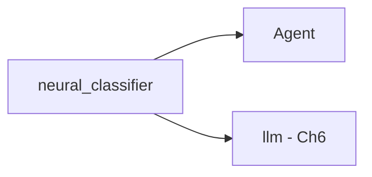

# Lab Integration — Neural Classifier

> "Representation is learned—not programmed."
> — Deep learning

---
layout: default
---

# Conceptual Core

- Recap: architecture, training, regularization, GPU
- neural_classifier in student-ai/
- Ch6: LLM—similar architectures, generative

---
layout: default
---

# Conceptual Core (continued)

- Learned vs. hand-coded representation
- Epistemic machine: categorical judgments

---
layout: default
---

# Technical Example

- End-to-end: train → predict
- Submodule integration
- Connection to llm (Ch6): embeddings, shared representations

---
layout: default
---

# Philosophical Reflection

- Learned vs. programmed representation
- Epistemic shift: optimization finds features
- Opacity: agent uses outputs, doesn't see learning
.Figure 5.8: neural_classifier and Ch6 (llm) connection
[plantuml,ch05-l08,png,theme=sketchy-outline]
....
@startuml
start
:neural_classifier;
:Agent;
:llm - Ch6;
stop
@enduml
....

---
layout: default
---

# Discussion Prompts

- What is gained and lost when representation is learned?
- How does neural_classifier connect to the metabolism thesis (Ch1)?
- Is opacity a price worth paying?

---
layout: default
---

# Diagram

---
layout: default
---

# Lab Prep

- Complete Labs 1–3, submit, integrate
- Document API
- Ch6: LLM next

---
layout: center
---

# Questions?
